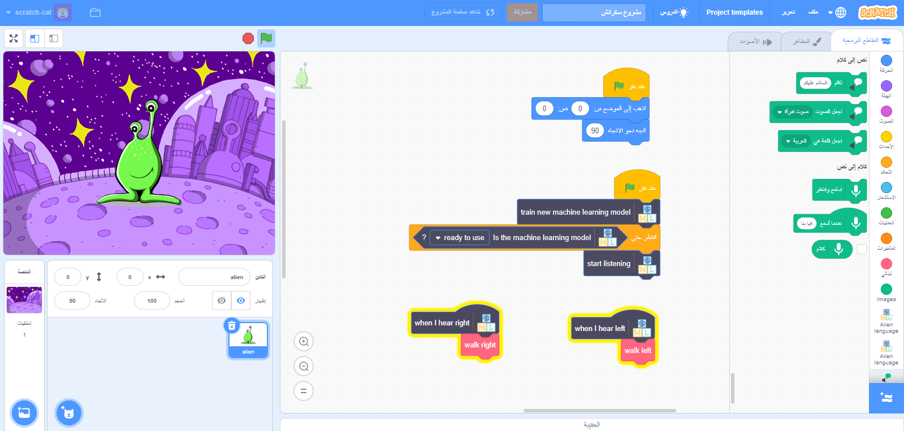

## المقدمة

في هذا المشروع ، سوف تقوم بتدريب الكمبيوتر لفهم لغة كائن الفضاء. ستستخدم ذلك للتحكم في شخصية غريبة حتى تتمكن من فهم ما تطلب منه للقيام به.

### ما الذي ستصنعه

- بدون طباعة -

--- /بدون طباعة ---

--- طباعة فقط ---

--- / للطباعة فقط -

--- collapse ---
---
title: ما ستحتاج إليه
---

+ كمبيوتر مع ميكروفون

+ خدمة الإنترنت

--- /collapse ---

--- collapse ---
---
title: ما الذي ستتعلمه
---
+ كيفية استخدام ملحق الكلام إلى نص في Scratch 3 مع نموذج prerained
+ كيفية تدريب نموذج تعلُّم الآلة للتعرف على الأصوات
+ كيفية استخدام نموذجك في تدريب الالة في سكراتش 3

--- /collapse ---

--- collapse ---
---
title: معلومات إضافية للمعلمين
---

إذا كنت بحاجة إلى طباعة هذا المشروع ، فالرجاء استخدام الإصدار [الملائم للطابعة](https://projects.raspberrypi.org/en/projects/alien-language/print){:target="_blank"}.

--- /collapse ---

### رخصة

هذا المشروع مرخص بشكل مزدوج بموجب [ ترخيص Creative Commons Attribution Non-Commercial Share-Alike ](http://creativecommons.org/licenses/by-nc-sa/4.0/) {: target = "_ blank"} و [ ترخيص Apache الإصدار 2.0 ](http://www.apache.org/licenses/LICENSE-2.0) {: target = "_ blank"}

نود أن نشكر دايل من machinelearningforkids.co.uk على جميع أعماله في هذا المشروع.
