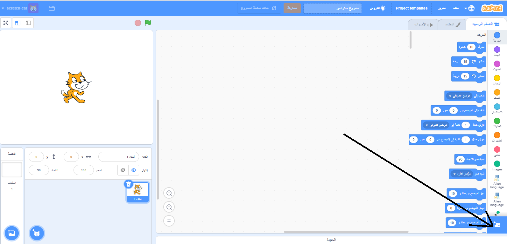
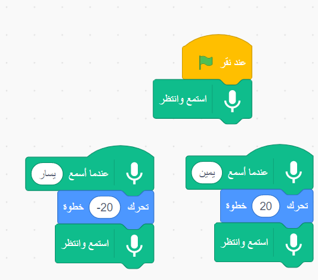

## استخدم نموذجًا تم تدريبه مسبقًا

--- task ---
+ انتقل إلى [machinelearningforkids.co.uk/scratch3](https://machinelearningforkids.co.uk/scratch3/){: target = "_ blank"}
--- / / مهمة ---

** تحذير: ** لا يمكن إتمام هذه الخطوة من المشروع إلا باستخدام متصفح الويب Google Chrome. إذا لم يكن هذا المتصفح متاحًا لك ، فيرجى التخطي إلى [ الخطوة 3: إنشاء مشروع جديد ](https://projects.raspberrypi.org/en/projects/alien-language/3)

--- task ---
+ بعد ذلك ، قم بتحميل ملحق **الكلام إلى النص**. انقر على زر **امتداد** في الركن الأيسر السفلي ، ثم اختر **كلام إلى نص** من القائمة. **ملاحظة:** تأكد من تحديد امتداد **Speech to Text** وليس ملحق **Text to Speech**. 

+ استخدم **أحداث** كتل ، **كتل Motions** ، وكتل **الكلام إلى نص** جديدة لإنشاء البرامج النصية التالية. 

--- /مهمة ---

--- مهمة --- انقر على العلم الأخضر لاختبار البرنامج الخاص بك. قل "يسار" أو "يمين". يجب أن تتحرك قطة السكراتش في الاتجاه الذي تطلبه. استخدم صوتك لمحاولة تحريك قط السكراتش ذهابًا وإيابًا عبر الشاشة. حاول التحدث بهدوء ووضوح.

قد يكون من الصعب تشغيلها. إذا لم يفلح ذلك ، أضف التعليمة البرمجية ` قل ` بحيث يبدو النص الخاص بك مثل النص أدناه ، لإظهار ما يعتقد أنك تقول. <0 /> --- / مهمة ---

لقد استخدمت الآن التعرف على الكلام للتحكم في شخصية في سكراتش.

في هذه الخطوة ، لكي يعمل برنامجك بسرعة ، استخدمت نموذجًا للتعلم الآلي تم تدريبه لك بالفعل. إنه نموذج عام للتعلم الآلي تم تدريبه على التعرف على الكلمات في قاموس اللغة الإنجليزية. 
