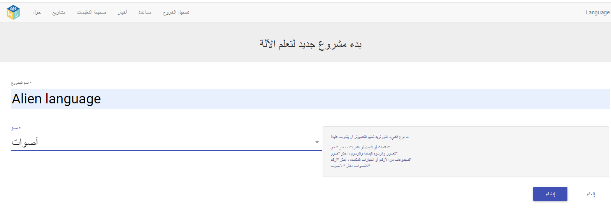

## أنشئ مشروعًا جديدًا
في الخطوات القليلة التالية ، ستقوم بتدريب نموذج تعلُّم الآلة لترى كيف تم ذلك. بالنسبة للجزء التالي من المشروع ، ستستخدم صوتك للتحكم في شخصية كائن الفضاء التي لا تفهم اللغة الإنجليزية! سوف تخترع كلمتين جديدتين لن يتم العثور عليهما في قاموس اللغة الإنجليزية. بعد ذلك ، سوف تستخدم الكلمات للتحكم في شخصية كائن الفضاء ، وتدريب نموذج للتعلم الالة للتعرف عليها.

أولاً ، انتقل إلى موقع Machine Learning for Kids وإنشاء مشروع.

--- task ---
+ انتقل إلى [machinelearningforkids.co.uk](https://machinelearningforkids.co.uk/){:target="_blank"}.

+ انقر على **لتبدأ**.

+ انقر على **جربه الآن**. --- /task ---

--- task ---
+ انقر على **مشاريع** في شريط القائمة في أعلى الصفحة.

+ انقر فوق الزر **إضافة مشروع جديد**.

+ قم بتسمية مشروعك `Alien Language` وقم بتعيينه على تعلم كيفية التعرف على `الأصوات `. ثم، انقر فوق زر **اصنع**. 

+ يجب أن تشاهد `لغة كائن الفضاء` في قائمة المشاريع. انقر على مشروع `لغة كائن الفضاء`. --- /task ---
