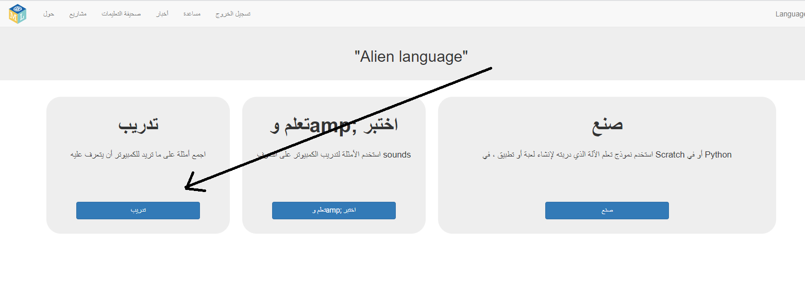
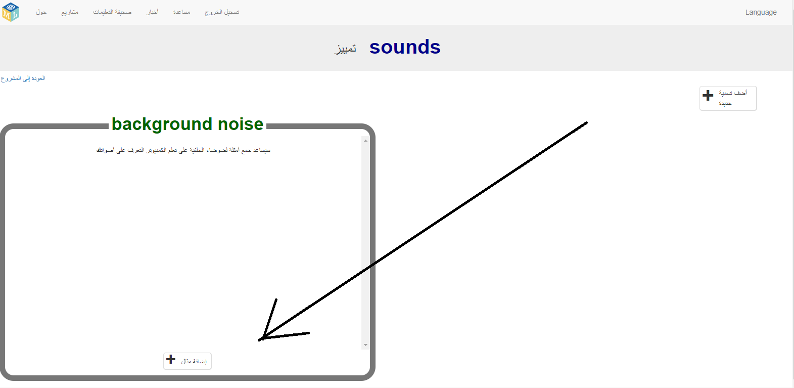
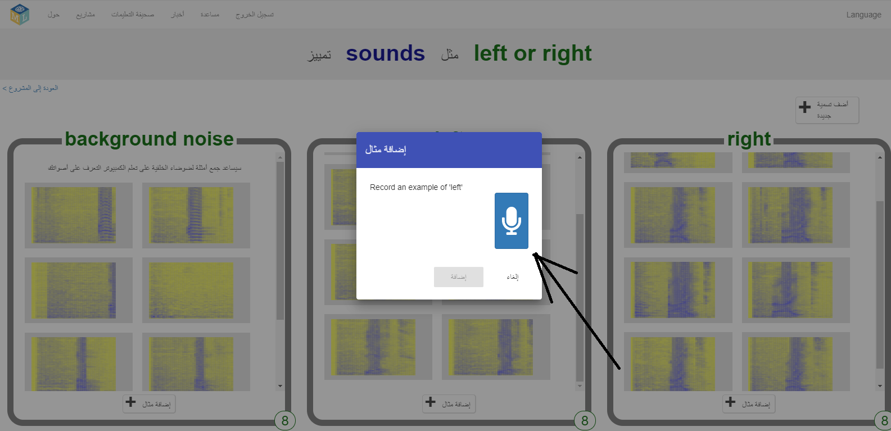
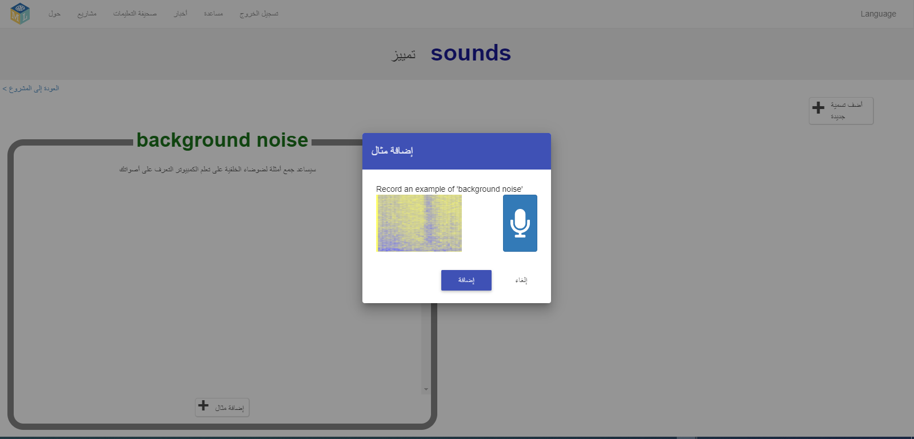
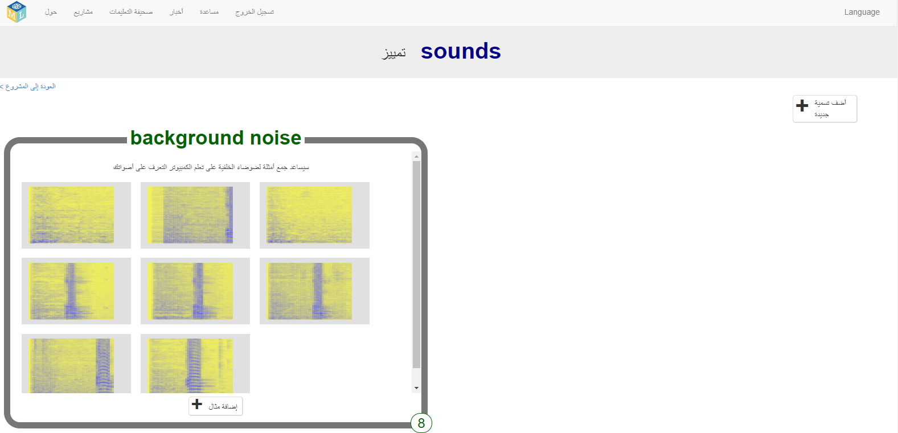
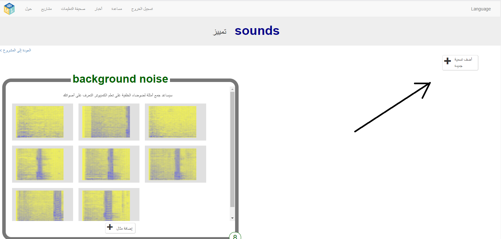
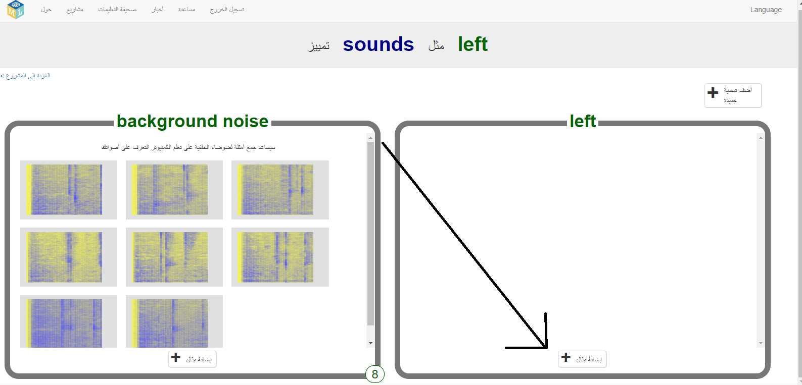
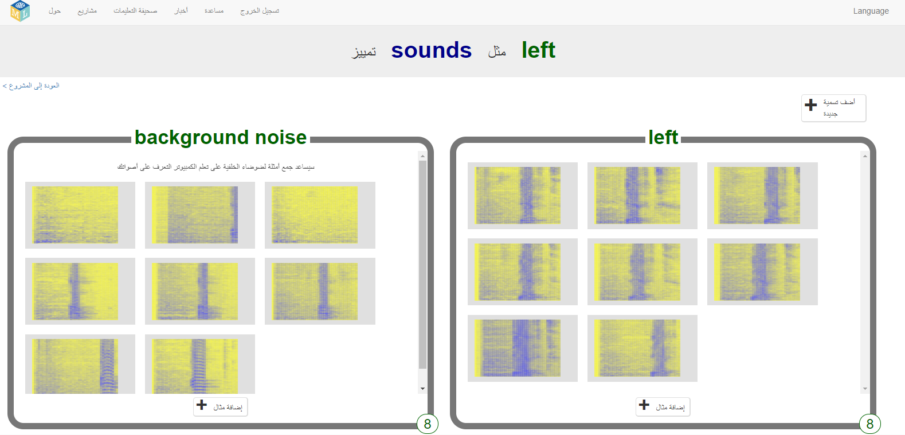
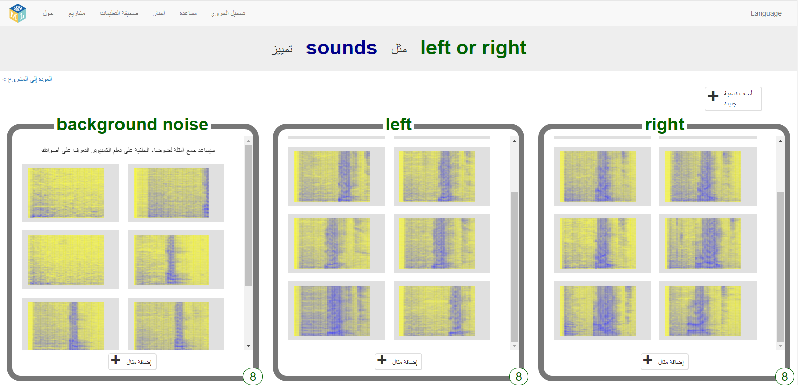

## إنشاء كلمات كائن الفضاء
في هذه الخطوة ، سوف تخترع كلمات كائن الفضاء.

--- task ---

تحتاج إلى كلمتين - كلمة كائن الفضاء لل "يسار" وكلمة كائن الفضاء لـل "يمين". اخترع كلمتين جديدتين لن تكونا في قاموس اللغة الإنجليزية. يمكن أن تكون ضوضاء بشكل عشوائي ، طالما يمكنك تكرارها بالطريقة نفسها في كل مرة وتكون مختلفة بشكل ملحوظ عن بعضها البعض. إذا كنت لا تريد أن تصدر أصواتًا بصوتك ، فلا بأس بذلك - يمكنك العثور على طرق أخرى لعمل الضوضاء. يمكنك النقر فوق أصابعك أو تصفيق يديك أو الضغط على لعبة صاربة أو القيام بأي شيء آخر يمكنك التفكير فيه! فقط تأكد من تذكر كلماتك الجديدة!

---/task--

--- task ---

+ انقر على زر **تدريب** للبدء في جمع الأمثلة. 

+ انقر على زر **إضافة مثال** لاضافته في **background noise** (المقصود بها المكان الذي انت به خلال تسجيل صوت يختلف عن الكلمتين التي سوف تحرك بها كائن الفضاء). سيساعد تسجيل background noise نموذج تدريب الالة على تحديد الفرق بين الأصوات التي ستقوم بتدريبها للتعرف عليها ، والاصوات التي في مكانك. 

+ انقر على الميكروفون لتسجيل ضجيج الخلفية لمدة ثانيتين. 

+ انقر فوق زر **اضافة** لحفظ التسجيل الخاص بك. 

+ كرر هذه الخطوات حتى يكون لديك **8 أمثلة على الأقل** لضوضاء الخلفية. 

--- /task ---

--- task ---

+ انقر فوق زر **اضافة تسمية جديدة** في أعلى الزاوية اليمنى للصفحة، وانشاء محتوى تدريب جديد باسم`left` يجب ان تكون التسمية باللغة الانكليزية. 

+ انقر على زر**إضافة مثال** الموجود في المحتوى**left** الجديد. 

+ سجل ** عن لا يقل عن 8 أمثلة** لكلمة "left" لكائن الفضاء. 

--- /task ---

--- task ---

+ انقر فوق زر **اضافة تسمية جديدة** في أعلى الزاوية اليمنى للصفحة، وانشاء محتوى تدريب جديد باسم`Right` يجب ان تكون التسمية باللغة الانكليزية.

+ انقر على زر**إضافة مثال** الموجود في المحتوى**Right** الجديد.

+ سجل ** عن لا يقل عن 8 أمثلة** لكلمة "Right" لكائن الفضاء. 

+ **ملاحظة:** بنهاية هذه الخطوة ، يجب أن يكون لديك ثمانية أمثلة في كل محتوى من المجموعات الثلاثة.

---/task---
