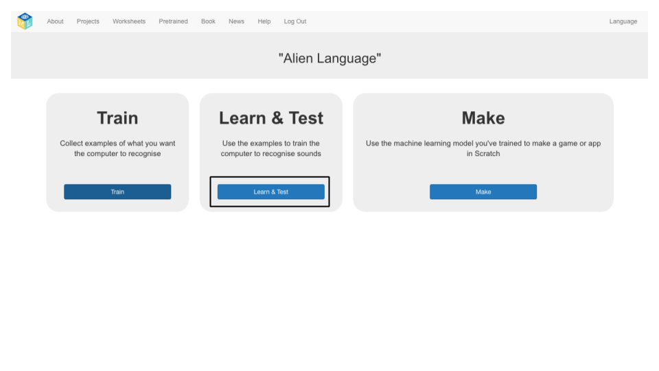
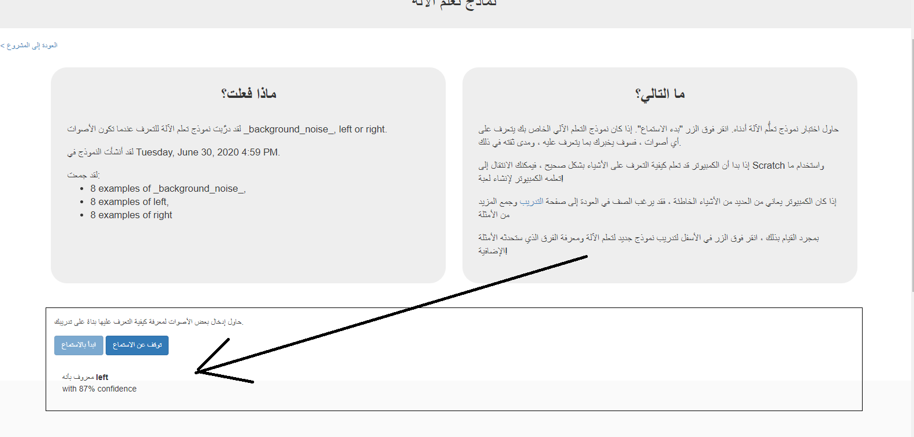

## تدريب نموذج تعلم الآلة الجديد
في هذه الخطوة ، سوف تستخدم الأمثلة التي قمت بجمعها في الخطوة الأخيرة لتدريب الكمبيوتر على كيفية التعرف على كلماتك الجديدة.

--- task ---

+ انقر على الرابط **رجوع إلى المشروع** في الركن الأيسر العلوي. 

+ انقر فوق زر**تعلم & اختبار**. 

+ انقر على **تدريب نموذج التعلم الآلي الجديد**. قد يستغرق هذا بضع دقائق حتى يكتمل. 

---/task--

--- task ---

+ وبمجرد الانتهاء من التدريب، انقر فوق زر**بدء الاستماع** لاختبار نموذج تدريب الالة. قل إحدى الكلمات (أو قم بأحد الأصوات) التي قمت بتدريب الحاسوب للتعرف عليها كـ "يسار" أو "يمين". إذا كان نموذج التعلم الآلي الخاص بك يتعرف عليه ، فسيعرض ما يعتقد أنه قلته. 

+ إذا لم تكن راضيًا عن كيفية عمل النموذج ، فارجع إلى صفحة **Train** وأضف المزيد من الأمثلة إلى مجموعات التدريب الثلاثة.

+ عندما تكون راضيًا عن نموذج التعلم الآلي الخاص بك ، انتقل إلى الخطوة التالية.

--- /task ---
