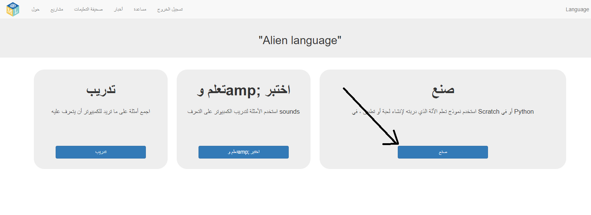
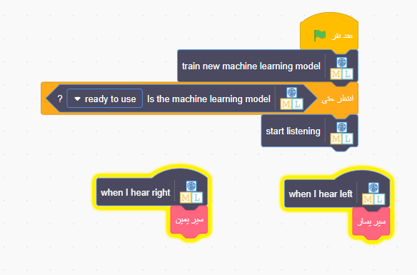

## استخدم كلمات كائن الفضاء في سكراتش
في هذه الخطوة ، سوف تستخدم تعلم الآلة الجديد في Scratch.

--- task ---

+ انقر فوق الزر **صنع**. 

+ انقر فوق زر **سكراتش 3** ، ثم انقر فوق **فتح في سكراتش 3**.

+ انقر فوق **Project templates** في الجزء العلوي من الشاشة ، ثم اختر مشروع **Alien Language**.

--- /task ---

--- task ---

+ إلقاء نظرة على البرامج النصية لكائن الفضاء. التعليمات البرمجية الموجودة بالفعل ستضع الكائن الفضائي في المكان المناسب في البداية وتحريك كيفية سيره. لا تحذفهم. أضف التعليمات البرمجية أدناه إلى شخصية كائن الفضاء ، أسفل التعليمات البرمجية الموجودة بالفعل. 

+ الآن ، اختبر البرنامج الخاص بك! انقر على العلم الأخضر. قل كلماتك (أو قم بأصواتك) "يسار" و "يمين" لتخبر كائن الفضاء اي طريق يمشي.

--- /task ---

لقد قمت الآن بتدريب نموذج تعلم الآلة الخاص بك على التعرف على الكلام واستخدمت ذلك للتحكم في شخصية في سكراتش. على عكس النموذج الذي تم اختباره مسبقًا والذي استخدمته سابقًا في المشروع ، والذي تم تدريبه على التعرف على عشرات الآلاف من الكلمات ، فقد قمت بتدريبه فقط على التعرف على كلمتين مختلفتين. ومع ذلك ، فإن المبدأ هو نفسه.

لقد رأيت أيضًا أهمية تدريب نموذج تدريب الآلة على التعامل مع ضجيج خلفية اصوات اخرى.

--- task ---

هل يمكنك التفكير في مثال لنظام مثل هذا الذي رأيته من قبل؟ على سبيل المثال ، تستخدم بعض السيارات أنظمة التعرف على الكلام التي تم تدريبها للتعرف على الأوامر المختلفة التي يمكنك تقديمها للحاسوب الموجود في السيارة. ما هي الأمثلة الأخرى التي استخدمتها؟

---/task---
