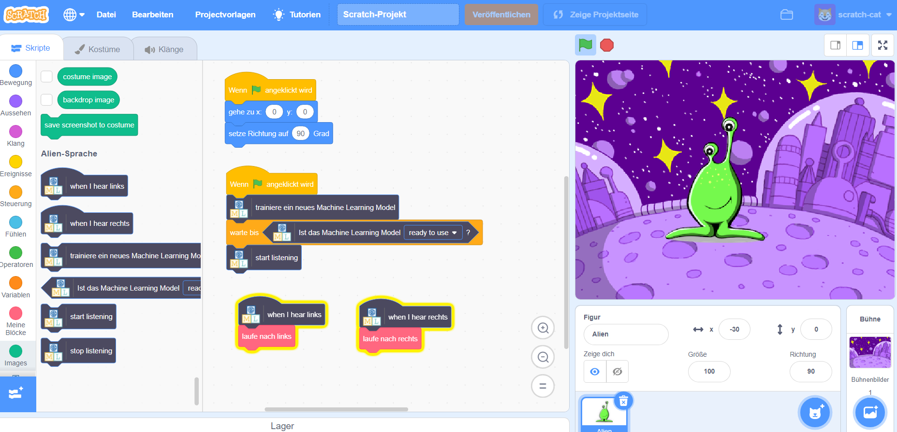

## Einleitung

In diesem Projekt wirst du den Computer trainieren, um eine außerirdische Sprache zu verstehen. Du wirst einen Alien-Charakter steuern, damit dieser versteht, was du ihm sagst.

### Was du machen wirst

--- no-print ---

--- /no-print ---

--- print-only ---

--- /print-only ---

--- collapse ---
---
title: Was du brauchen wirst
---

+ Ein Computer mit Mikrofon

+ Einen Internetzugang

--- /collapse ---

--- collapse ---
---
title: Was du lernen wirst
---
+ Wie du eine Sprache-zu-Text-Erweiterung in Scratch 3 mit einem vorab trainierten Modell benutzt
+ Wie man ein maschinelles Lernmodell trainiert, um Geräusche zu erkennen
+ Wie du dein trainiertes maschinelles Lernmodell in Scratch 3 verwendest

--- /collapse ---

--- collapse ---
---
title: Zusätzliche Informationen für Pädagogen
---

Wenn du dieses Projekt ausdrucken möchtest, verwende die [druckerfreundliche Version](https://projects.raspberrypi.org/en/projects/alien-language/print){:target="_blank"}.

--- /collapse---

### Lizenz

Dieses Projekt ist zweifach lizenziert, sowohl unter einer [Creative Commons nicht-kommerziellen Weitergabelizenz](http://creativecommons.org/licenses/by-nc-sa/4.0/){: target = "_ blank"} und einer [Apache Lizenz Version 2.0](http://www.apache.org/licenses/LICENSE-2.0){: target = "_ blank"}

Wir möchten Dale von machinelearningforkids.co.uk für seine Arbeit an diesem Projekt danken.
