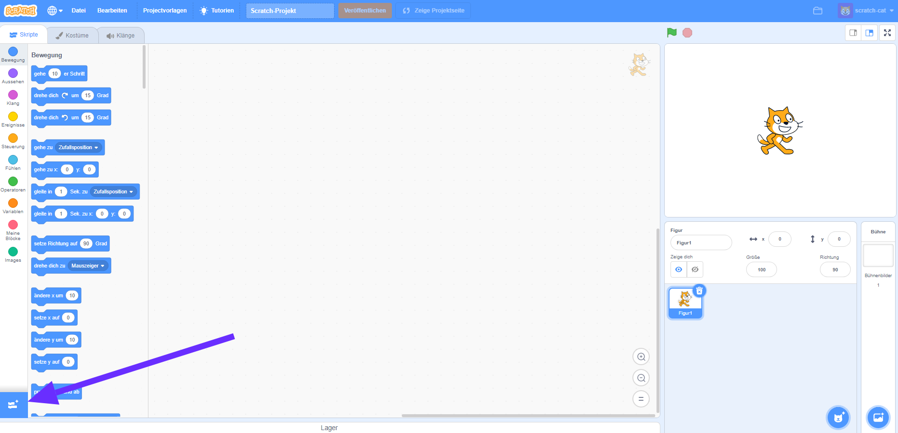
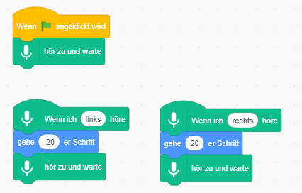

## Verwende ein vortrainiertes Modell

--- task ---
+ Gehe zu [machinelearningforkids.co.uk/scratch3](https://machinelearningforkids.co.uk/scratch3/){:target="_blank"}
--- / task ---

**Warnung:** Dieser Schritt des Projekts kann nur mit dem Google Chrome-Webbrowser ausgeführt werden. Wenn Dir dieser Browser nicht zur Verfügung steht, fahre mit [Schritt 3: Erstelle ein neues Projekt](https://projects.raspberrypi.org/de-DE/projects/alien-language/3) fort

--- task ---
+ Lade als Nächstes die Erweiterung **Sprache zu Text**. Klicke auf die Schaltfläche **Erweiterungen** in der unteren linken Ecke und wähle dann aus der Liste **Sprache zu Text** aus. **Hinweis:** Stelle sicher, dass du die Erweiterung **Sprache zu Text** und nicht die Erweiterung **Text zu Sprache** auswählst. 

+ Verwende die Blöcke **Ereignisse**, **Steuerung** und die neuen Blöcke **Sprache zu Text**, um die folgenden Skripte zu erstellen. 

--- /task ---

--- task --- Klicke auf die grüne Flagge, um dein Projekt zu testen. Sage "links" oder "rechts". Die Scratch-Katze sollte sich in die Richtung bewegen, die du ihr sagst. Verwende deine Stimme, um zu versuchen, die Scratch-Katze über den Bildschirm hin und her zu bewegen. Versuche, ruhig und klar zu sprechen.

Es kann schwierig sein, es zum Laufen zu bringen. Wenn es nicht funktioniert, füge `sage`-Blöcke hinzu, sodass dein Skript, wie das folgende Skript aussieht, um zu zeigen, was es denkt, was du gesagt hast. --- /task ---

Du hast jetzt die Spracherkennung verwendet, um einen Charakter in Scratch zu steuern.

In diesem Schritt hast du ein maschinelles Lernmodell verwendet, das bereits für dich trainiert wurde, damit dein Programm schnell funktioniert. Es ist ein allgemeines maschinelles Lernmodell, das darauf trainiert wurde, Wörter im deutschen Wörterbuch zu erkennen. 
