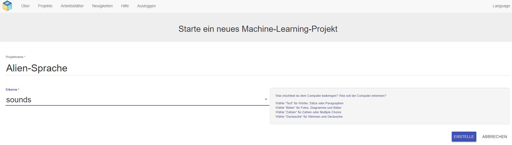

## Erstelle ein neues Projekt
In den nächsten Schritten wirst du ein maschinelles Lernmodell trainieren, um zu sehen, wie es erstellt wurde. Im nächsten Teil des Projekts steuerst du mit deiner Stimme einen außerirdischen Charakter, der kein Deutsch versteht! Du wirst zwei neue Wörter erfinden, die in einem deutschen Wörterbuch nicht zu finden sind. Verwende die Wörter anschließend, um den außerirdischen Charakter zu steuern und trainiere ein maschinelles Lernmodell, um sie wieder erkennen zu lassen.

Rufe zunächst die Website für maschinelles Lernen für Kinder auf und erstelle ein Projekt.

--- task ---
+ Gehe zu [machinelearningforkids.co.uk](https://machinelearningforkids.co.uk/){:target="_blank"}. Ändere die Sprache in der rechten Menüleiste 'Language' auf Deutsch.

+ Klicke auf **Los geht's**.

+ Klicke auf **Jetzt testen**. --- /task ---

--- task ---
+ Klicke in der Menüleiste oben auf der Seite auf **Projekte**.

+ Klicke auf die Schaltfläche **Erstelle ein neues Projekt**.

+ Nenne dein Projekt `Alien Sprache` und lege fest, wie `Sounds` (Geräusche) erkannt werden. Klicke dann auf die Schaltfläche **Erstelle**. 

+ Du solltest `Alien Sprache` in der Projektliste sehen. Klicke auf auf das Projekt `Alien Sprache`. --- /task ---
