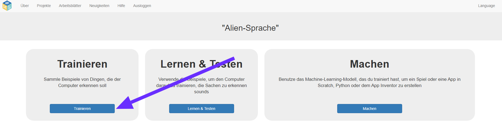
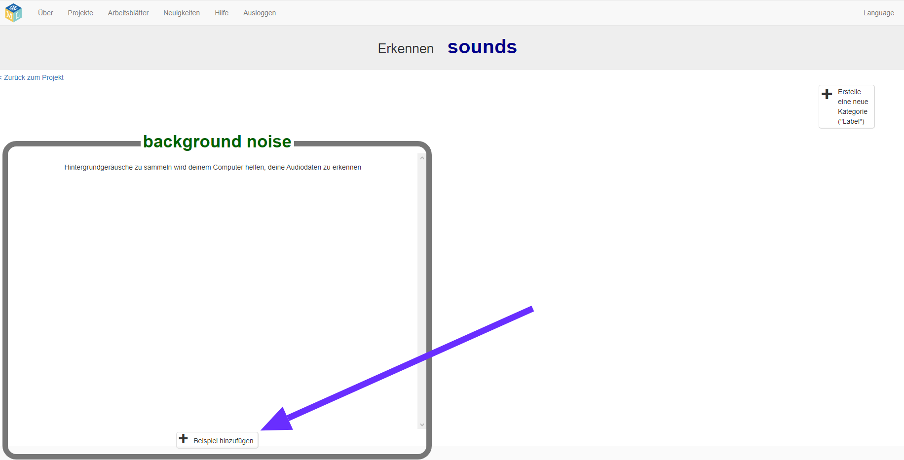
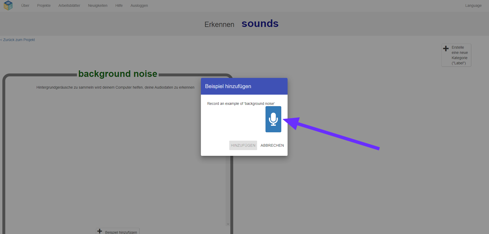
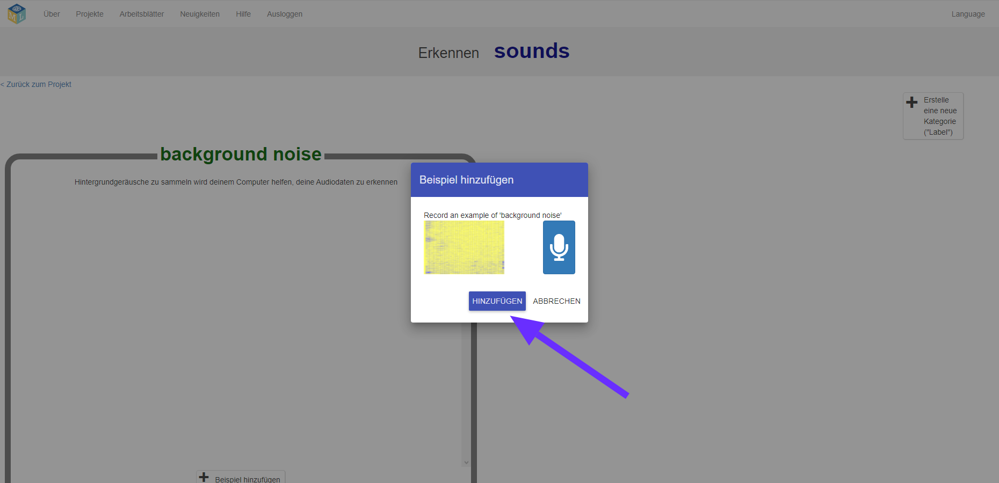
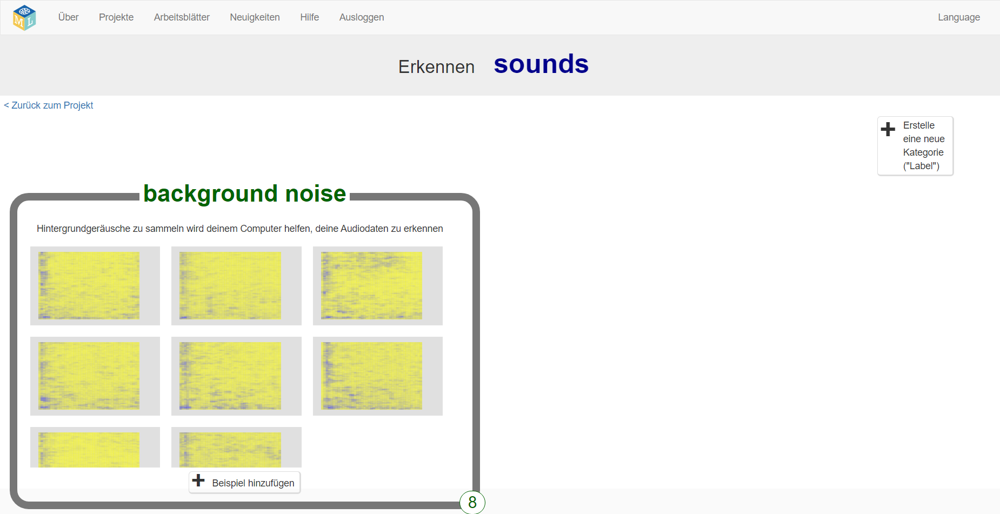
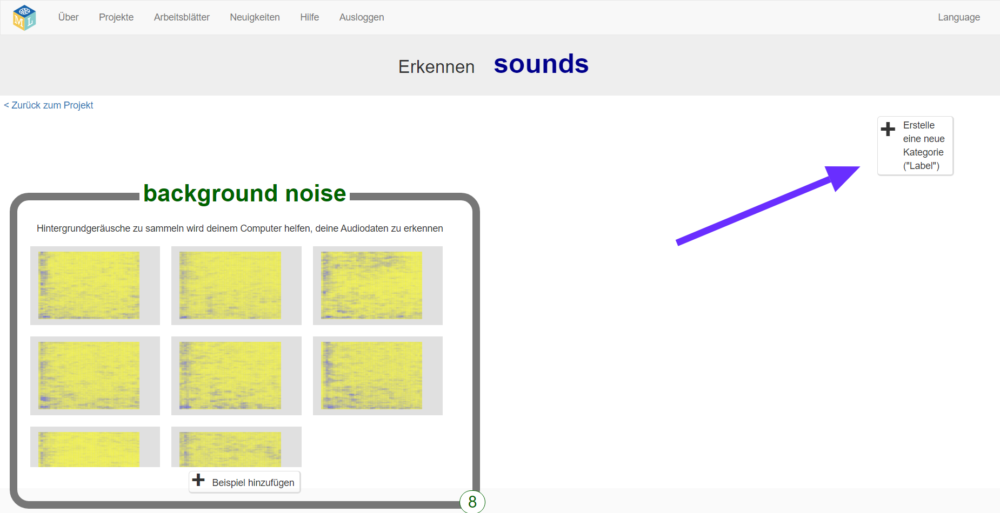
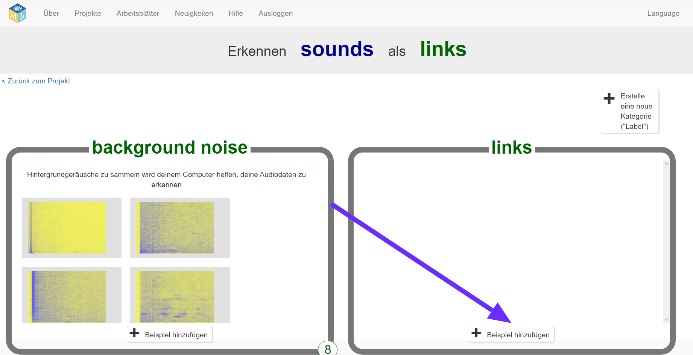
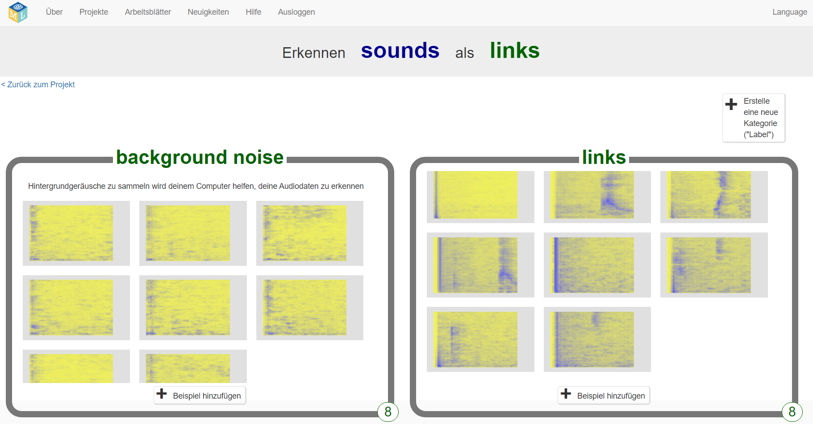
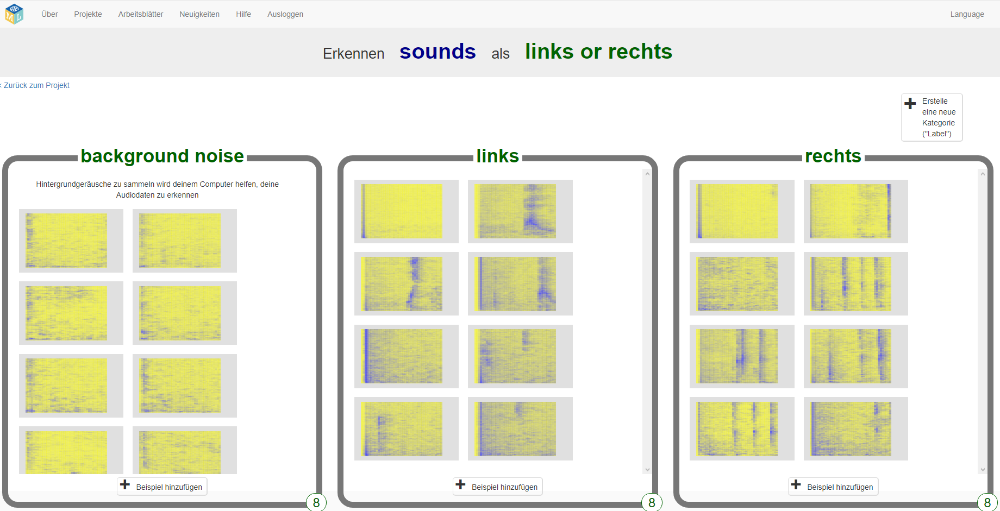

## Erstelle außerirdische Wörter
In diesem Schritt erfindest du deine außerirdischen Wörter.

--- task ---

Du benötigest zwei Wörter - ein außerirdisches Wort für "links" und ein außerirdisches Wort für "rechts". Erfinde zwei neue Wörter, die in einem deutschen Wörterbuch nicht vorkommen würden. Dies können zufällige Geräusche sein, solange du sie jedes Mal auf die gleiche Weise wiederholen kannst und sie sich erkennbar voneinander unterscheiden. Wenn du mit deiner Stimme keine Geräusche machen möchtest, ist das in Ordnung - Du kannst andere Wege finden, um Geräusche zu machen. Du kannst mit den Fingern klicken, in die Hände klatschen, ein quietschendes Spielzeug drücken oder alles tun, was du dir vorstellen können! Stelle einfach sicher, dass du dich an deine neuen Wörter erinnern kannst!

--- /task ---

--- task ---

+ Klicke auf die Schaltfläche **Trainieren**, um Beispiele zu sammeln. 

+ Klicke im Bereich **background noise** (Hintergrundgeräusche) auf die Schaltfläche **Beispiel hinzufügen**. Das Aufzeichnen von Hintergrundgeräuschen hilft deinem Modell für maschinelles Lernen dabei, den Unterschied zwischen den Geräuschen, die du wiedererkennen willst, und den Hintergrundgeräuschen zu erkennen, in denen du dich befindest. 

+ Klicke auf das Mikrofon, um 2 Sekunden Hintergrundgeräusche aufzunehmen. 

+ Klicke auf die Schaltfläche **Hinzufügen**, um deine Aufnahme zu speichern. 

+ Wiederhole diese Schritte, bis du **mindestens 8 Beispiele** für Hintergrundgeräusche hast. 

--- /task ---

--- task ---

+ Klicke auf die Schaltfläche **Erstelle eine neue Kategorie ("Label")** in der oberen rechten Ecke und erstelle eine neue Trainingszelle mit der Bezeichnung `links`. 

+ Klicke in der neuen Zelle **links** auf die Schaltfläche **Beispiel hinzufügen**. 

+ Nimm **mindestens 8 Beispiele** deines außerirdischen Wortes für „links“ auf. 

--- /task ---

--- task ---

+ Klicke erneut auf die Schaltfläche **Erstelle eine neue Kategorie ("Label")** in der oberen rechten Ecke und erstelle eine neue Trainingszelle mit der Bezeichnung `rechts`.

+ Klicke in der neuen Zelle **rechts** auf die Schaltfläche **Beispiel hinzufügen**.

+ Nimm **mindestens 8 Beispiele** deines außerirdischen Wortes für „rechts“ auf. 

+ **Hinweis:** Am Ende dieses Schritts müssen sich in jedem der drei Zellen acht Beispiele befinden.

--- /task ---
