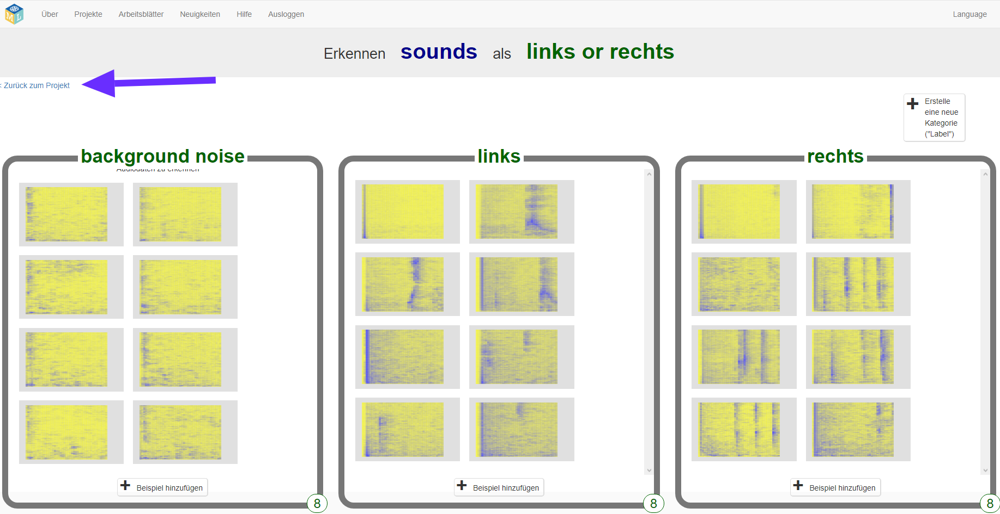
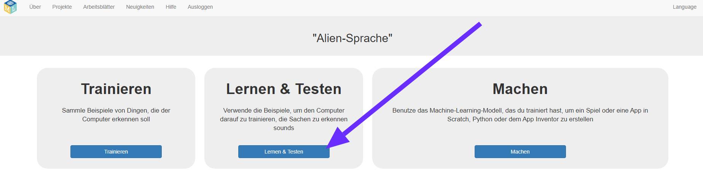
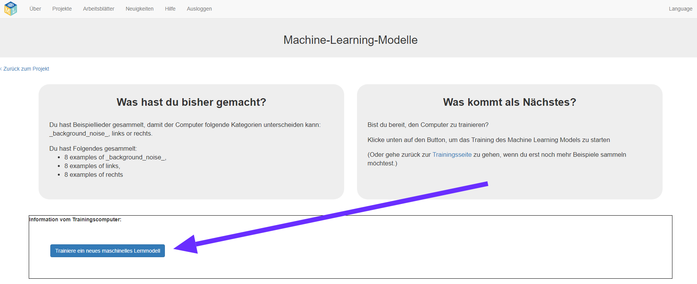
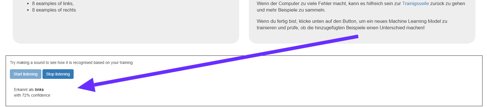

## Trainiere ein neues maschinelles Lernmodell
In diesem Schritt verwendest du die Beispiele, die du im letzten Schritt gesammelt hast, um dem Computer das Erkennen deiner neuen Wörter beizubringen.

--- task ---

+ Klicke oben links auf den Link **Zurück zum Projekt**. 

+ Klickee auf die Schaltfläche **Lernen & Testen**. 

+ Klicke auf **Trainiere ein neues maschinelles Lernmodell**. Dies kann einige Minuten dauern. 

--- /task ---

--- task ---

+ Klicke nach Abschluss des Trainings auf die Schaltfläche **Start listening** (Hörprobe starten), um dein maschinelles Lernmodell zu testen. Sprich eines der Wörter (oder mache eines der Geräusche), die du dem Computer beigebracht hast, als "links" oder "rechts" zu erkennen. Wenn dein maschinelles Lernmodell dies erkennt, wird angezeigt, was es denkt, was du gesagt hast. 

+ Wenn du mit der Funktionsweise des Modells nicht zufrieden bist, kehre zur Seite **Trainieren** zurück und füge zu allen drei Trainingszellen weitere Beispiele hinzu.

+ Wenn du mit deinem maschinellen Lernmodell zufrieden bist, fahre mit dem nächsten Schritt fort.

--- /task ---
