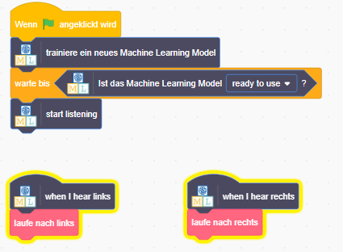

## Verwende außerirdische Wörter in Scratch
In diesem Schritt verwendest du dein neues maschinelles Lernen in Scratch.

--- task ---

+ Klicke auf die Schaltfläche **Machen**. 

+ Klicke auf die Schaltfläche **Scratch 3** und dann auf **In Scratch 3 öffnen**.

+ Klicke oben auf dem Bildschirm auf **Projektvorlagen** und öffne dann die Projektvorlage **Alien Language**.

--- /task ---

--- task ---

+ Schaue dir die Skripte für die Alien-Figur an. Die Skripte, die bereits vorhanden sind, bringen die Alien-Figur zu Beginn an die richtige Stelle und animieren es, wie es läuft. Lösche sie nicht. Füge das folgende Skript unter den Skripten, die bereits vorhanden sind, zu der Alien-Figur hinzu. 

+ Teste jetzt dein Programm! Klicke auf die grüne Flagge. Sage deine Worte (oder mache deine Geräusche) für "links" und "rechts", um dem Außerirdischen zu sagen, welchen Weg er gehen sollen.

--- /task ---

Du hast jetzt dein eigenes Modell für maschinelles Lernen für die Spracherkennung trainiert und damit einen Charakter in Scratch gesteuert. Im Gegensatz zu dem zuvor in diesem Projekt verwendeten vortrainierten Modell, das zum Erkennen von Zehntausenden von Wörtern trainiert wurde, wurde es nur zum Erkennen von zwei verschiedenen Wörtern trainiert. Das Prinzip ist jedoch dasselbe.

Du hast auch erkannt, wie wichtig es ist, das Modell für maschinelles Lernen für die Arbeit mit bestimmten Hintergrundgeräuschen zu trainieren.

--- task ---

Kannst du Dir ein Beispiel für ein solches System vorstellen, das du zuvor gesehen hast? Beispielsweise verwenden einige Fahrzeuge Spracherkennungssysteme, die darauf trainiert wurden, die verschiedenen Befehle zu erkennen, die du an den Computer im Auto geben kannst. Welche anderen Beispiele hast Du verwendet?

--- /task ---
