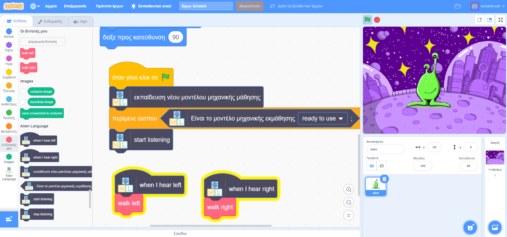

## Εισαγωγή

Σε αυτό το πρόγραμμα, θα εκπαιδεύσεις τον υπολογιστή να καταλαβαίνει μια ξένη γλώσσα. Θα το χρησιμοποιήσεις για να ελέγξεις έναν εξωγήινο χαρακτήρα, ώστε να καταλαβαίνει τι του λες να κάνει.

### Τι θα φτιάξεις

--- no-print ---

--- /no-print ---

--- print-only ---

--- /print-only ---

--- collapse ---
---
title: Τι θα χρειαστείς
---

+ Ένας υπολογιστής με μικρόφωνο

+ Πρόσβαση στο διαδίκτυο

--- /collapse ---

--- collapse ---
---
title: Τι θα μάθεις
---
+ Πώς να χρησιμοποιείς την επέκταση Ομιλία σε Κείμενο στο Scratch 3 με ένα ήδη ρυθμισμένο μοντέλο
+ Πώς να εκπαιδεύσεις ένα μοντέλο μηχανικής μάθησης για να αναγνωρίζει τους ήχους
+ Πώς να χρησιμοποιείς το εκπαιδευμένο μοντέλο εκμάθησης μηχανών σας στο Scratch 3

--- /collapse ---

--- collapse ---
---
title: Πρόσθετες πληροφορίες για εκπαιδευτικούς
---

Αν χρειαστεί να εκτυπώσεις αυτό το έργο, χρησιμοποίησε την [εκτυπώσιμη έκδοση](https://projects.raspberrypi.org/el-GR/projects/alien-language/print){:target="_blank"}.

--- /collapse ---

### Άδεια

Το έργο διπλής άδειας σύμφωνα με την άδεια τόσο από [Creative Commons Attribution Μη Εμπορική Share-Alike License](http://creativecommons.org/licenses/by-nc-sa/4.0/){:target="_blank"} και [άδεια Apache 2.0 Έκδοση](http://www.apache.org/licenses/LICENSE-2.0){:target="_blank"}

Θα θέλαμε να ευχαριστήσουμε τον Dale από το machinelearningforkids.co.uk για όλη τη δουλειά του σε αυτό το έργο.
