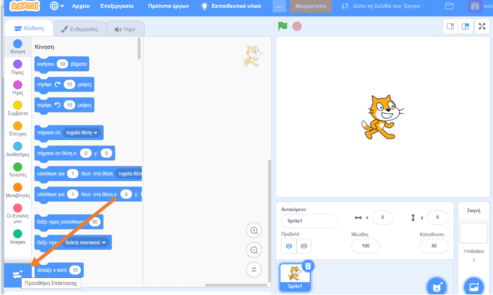
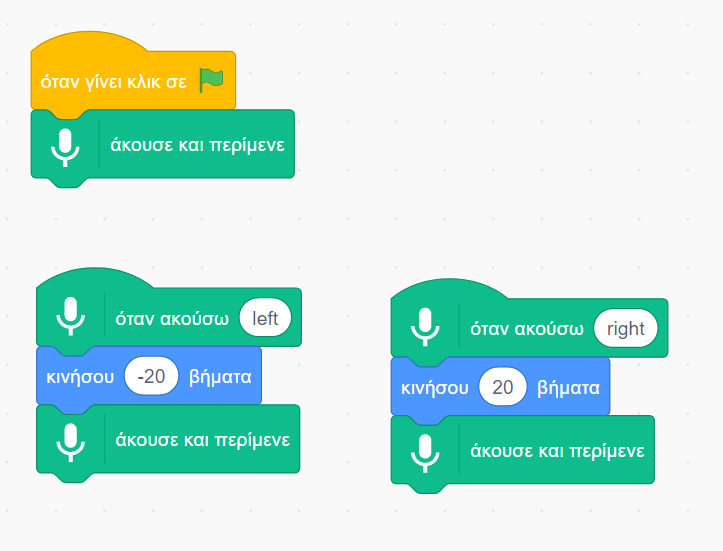
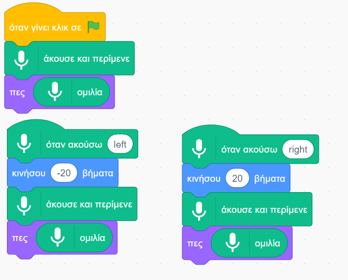

## Χρησιμοποίησε ένα ήδη εκπαιδευμένο μοντέλο

--- task ---
+ Πήγαινε στο [machinelearningforkids.co.uk/scratch3](https://machinelearningforkids.co.uk/scratch3/){:target="_blank"}
--- /task ---

**Προειδοποίηση:** Αυτό το βήμα του έργου μπορεί να ολοκληρωθεί μόνο χρησιμοποιώντας το πρόγραμμα περιήγησης ιστού Google Chrome. Εάν αυτό το πρόγραμμα περιήγησης δεν είναι διαθέσιμο για σένα, πήγαινε στο [βήμα 3: Δημιούργησε ένα νέο έργο](https://projects.raspberrypi.org/en/projects/alien-language/3)

--- task ---
+ Στη συνέχεια, φόρτωσε την επέκταση **Κείμενο σε Ομιλία**. Κάνε κλικ στο κουμπί **Προσθήκη Επέκτασης** στην κάτω αριστερή γωνία και, στη συνέχεια, επέλεξε **Ομιλία σε Κείμενο** από τη λίστα. **Σημείωση:** Βεβαιώσου ότι έχεις επιλέξει την επέκταση **Ομιλία σε Κείμενο** και όχι την επέκταση **Κείμενο σε Ομιλία**. 

+ Χρησιμοποίησε τα μπλοκ από τις κατηγορίες **Συμβάντα**, **Κίνηση** και **Ομιλία σε Κείμενο** για να δημιουργήσεις το παρακάτω σενάριο. 

--- /task ---

--- task --- Κάνε κλικ στην πράσινη σημαία για να ελέγξεις τον κώδικά σου. Πες "left" (αριστερά) ή "right" (δεξιά). Η γάτα του Scratch θα πρέπει να κινηθεί προς την κατεύθυνση στην οποία της λες. Χρησιμοποίησε τη φωνή σου για να μετακινήσεις τη γάτα του Scratch εμπρός και πίσω στην οθόνη. Προσπάθησε να μιλάς ήρεμα και καθαρά.

Μπορεί να είναι δύσκολο να το κάνεις να λειτουργήσει. Εάν δεν λειτουργεί, βάλε μερικά μπλοκ `πες` έτσι ώστε το σενάριό σου να μοιάζει με το παρακάτω σενάριο, για να δείχνει τι πιστεύει ότι λες.  --- /task ---

Τώρα έχεις χρησιμοποιήσει την αναγνώριση ομιλίας για τον έλεγχο ενός χαρακτήρα στο Scratch.

Σε αυτό το βήμα, για να λειτουργήσει γρήγορα το πρόγραμμά σου, χρησιμοποίησες ένα μοντέλο μηχανικής μάθησης που είχε ήδη εκπαιδευτεί για εσένα. Είναι ένα γενικό μοντέλο μηχανικής μάθησης που έχει εκπαιδευτεί για να αναγνωρίζει λέξεις στο αγγλικό λεξικό. 
