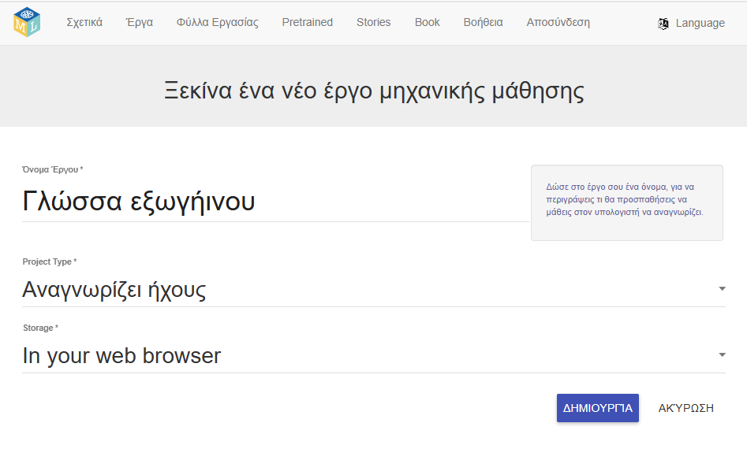
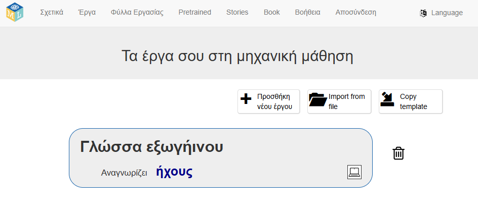
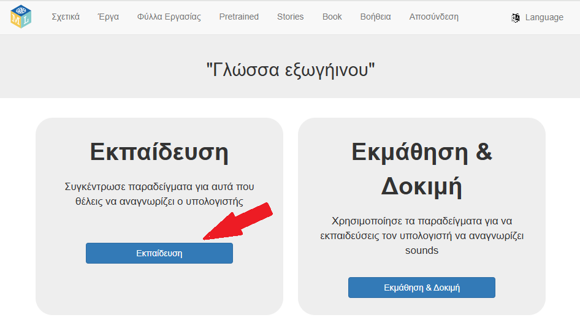
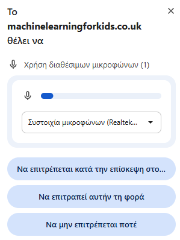

## Ρύθμιση του έργου

<html>
  

    <iframe style="position: absolute; top: 0; left: 0; right: 0; width: 100%; height: 100%; border: none;" src="https://www.youtube.com/embed/F4HePu4SNrs?rel=0&cc_load_policy=1" allowfullscreen allow="accelerometer; autoplay; clipboard-write; encrypted-media; gyroscope; picture-in-picture; web-share"></iframe>
  

</html>

--- task ---

+ Πήγαινε στο [machinelearningforkids.co.uk](https://machinelearningforkids.co.uk/){: target = "_ blank"} με ένα πρόγραμμα περιήγησης ιστού.

+ Κάνε κλικ στο **Ξεκίνα**.

+ Κάνε κλικ στο **Δοκιμή τώρα**.

--- /task ---

--- task ---

+ Κάνε κλικ στο **Έργα** στη γραμμή μενού στο επάνω μέρος.

+ Κάνε κλικ στο κουμπί **+ Προσθήκη νέου έργου**.

+ Ονόμασε το έργο σου `Γλώσσα εξωγήινου` και ρύθμισέ το ώστε να μαθαίνει να αναγνωρίζει **ήχους** και να αποθηκεύει δεδομένα **in your web browser**. Στη συνέχεια, κάνε κλικ στο κουμπί **Δημιουργία**. 

+ Θα πρέπει τώρα να δεις την επιλογή «Γλώσσα εξωγήινου» στη λίστα έργων. Κάνε κλικ στο έργο. 

--- /task ---

--- task ---

+ Κάνε κλικ στο κουμπί **Εκπαίδευση**. 

+ Εάν δεις ένα αναδυόμενο μήνυμα που σου ζητά άδεια να χρησιμοποιήσει το μικρόφωνο, κάνε κλικ στην επιλογή **Να επιτρέπεται κατά την επίσκεψη**.

--- /task ---

