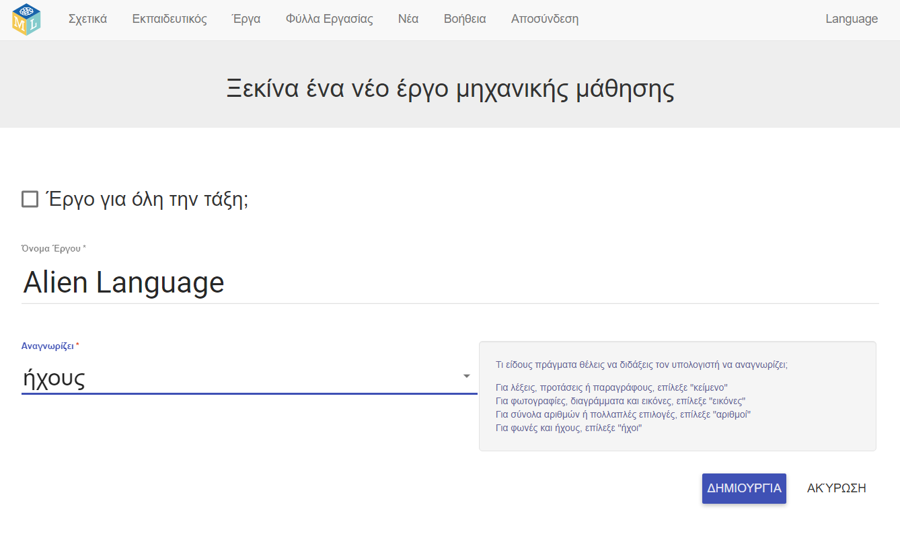

## Δημιούργησε ένα νέο έργο
Στα επόμενα βήματα, θα εκπαιδεύσεις ένα μοντέλο μηχανικής μάθησης για να δεις πώς έγινε αυτό. Για το επόμενο μέρος του έργου, θα χρησιμοποιήσεις τη φωνή σου για να ελέγξεις έναν εξωγήινο χαρακτήρα που δεν καταλαβαίνει Αγγλικά! Θα επινοήσεις δύο νέες λέξεις που δε βρίσκονται σε κάποιο λεξικό. Στη συνέχεια, θα χρησιμοποιήσεις τις λέξεις αυτές για να ελέγξεις τον εξωγήινο χαρακτήρα και θα εκπαιδεύσεις ένα μοντέλο μηχανικής μάθησης για να τα αναγνωρίσεις.

Πρώτα, πήγαινε στην ιστοσελίδα Machine Learning for Kids και δημιούργησε ένα έργο.

--- task ---
+ Πήγαινε στο [machinelearningforkids.co.uk](https://machinelearningforkids.co.uk/){:target="_blank"} και άλλαξε τη γλώσσα σε Ελληνικά.

+ Κάνε κλικ στο **Ξεκίνα**.

+ Κάνε κλικ στο **Δοκιμή τώρα**. --- /task ---

--- task ---
+ Κάνε κλικ στο **Έργα** στο μενού στο επάνω μέρος της σελίδας.

+ Κάνε κλικ στο κουμπί **Προσθήκη νέου έργου**.

+ Ονόμασε το έργο σου `Alien Language` και ρύθμισέ το να μαθαίνει να αναγνωρίζει `ήχους`. Στη συνέχεια, επίλεξε τη **Δημιουργία**. 

+ Θα πρέπει να βλέπεις το `Alien Language` στη λίστα έργων. Κάνε κλικ στο έργο `Alien Language`. --- /task ---
