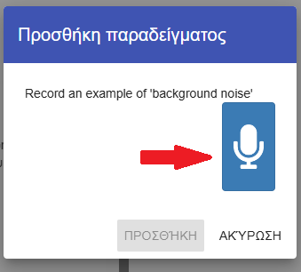
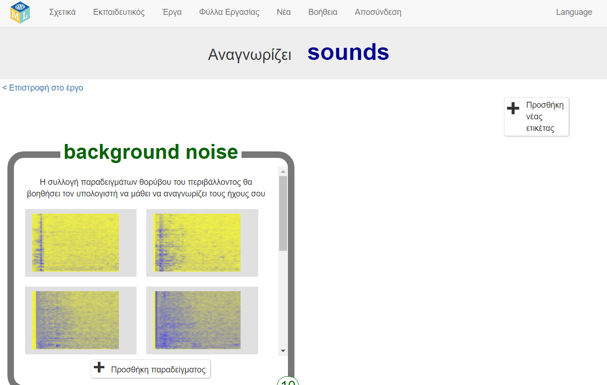

## Επινόησε δύο λέξεις

<html>
  

    <iframe style="position: absolute; top: 0; left: 0; right: 0; width: 100%; height: 100%; border: none;" src="https://www.youtube.com/embed/au4cDSYW_EQ?rel=0&cc_load_policy=1" allowfullscreen allow="accelerometer; autoplay; clipboard-write; encrypted-media; gyroscope; picture-in-picture; web-share"></iframe>
  

</html>

Αρχικά, θα συλλέξεις δείγματα θορύβου από το περιβάλλον. Αυτό θα βοηθήσει το μοντέλο μηχανικής μάθησης να διακρίνει τη διαφορά μεταξύ των ήχων και του θορύβου από το περιβάλλον, στο σημείο που βρίσκεσαι.

--- task ---

+ Κάνε κλικ στο πλήκτρο **+ Προσθήκη παραδείγματος** στην περιοχή **background noise**.

+ Κάνε κλικ στο μικρόφωνο, αλλά μη μιλήσεις. Ηχογράφηση θορύβου από το περιβάλλον για 2 δευτερόλεπτα. 

+ Κάνε κλικ στο πλήκτρο **Προσθήκη** για να αποθηκεύσεις την εγγραφή σου.

--- /task ---

--- task ---

+ Επανάλαβε αυτά τα βήματα έως ότου έχεις **τουλάχιστον οκτώ παραδείγματα** θορύβου από το περιβάλλον. 

--- /task ---

Επινόησε δύο λέξεις σε εξωγήινη γλώσσα— μια λέξη που σημαίνει «αριστερά» και μια λέξη που σημαίνει «δεξιά».

Τώρα θα καταγράψεις οκτώ παραδείγματα για κάθε λέξη, ώστε το μοντέλο μηχανικής μάθησης να μπορεί να μάθει να τις αναγνωρίζει.

--- task ---

+ Κάνε κλικ στο **+ Προσθήκη νέας ετικέτας** επάνω δεξιά στην οθόνη και πρόσθεσε μια ετικέτα που ονομάζεται `left`.

--- /task ---

--- task ---

+ Κάνε κλικ στο **+ Προσθήκη παραδείγματος** μέσα στο πλαίσιο για τη νέα ετικέτα `left` και ηχογράφησε τον εαυτό σου να λέει τη δική σου εξωγήινη λέξη για το "αριστερά".

+ Επανάλαβε μέχρι να καταγράψεις **τουλάχιστον οκτώ παραδείγματα**.

--- /task ---

--- task ---

+ Κλικ στο **+ Προσθήκη νέας ετικέτας** για να δημιουργήσεις μια άλλη ετικέτα με το όνομα `right` και να καταγράψεις οκτώ παραδείγματα στα οποία να λες τη δική σου εξωγήινη λέξη για το "δεξιά".

--- /task ---
