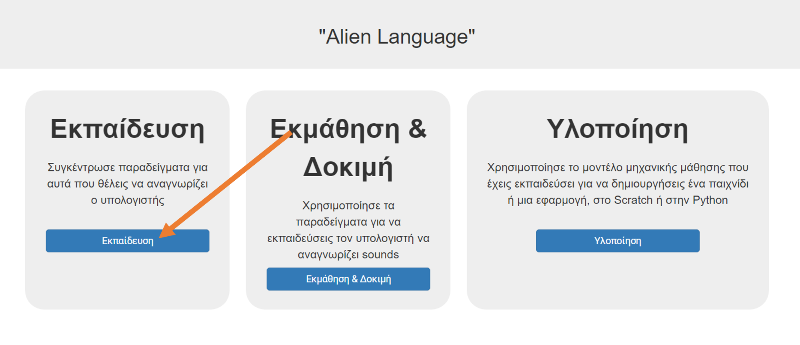
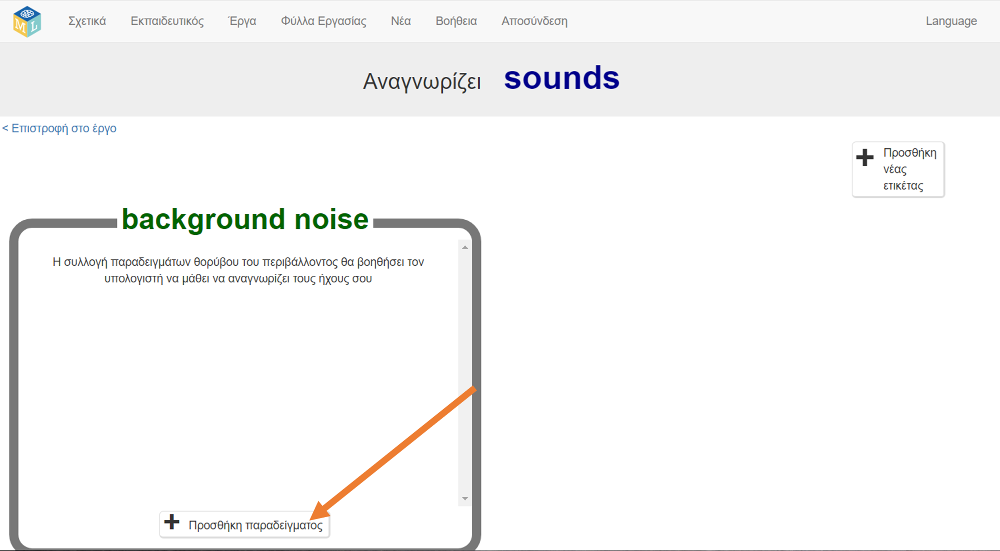
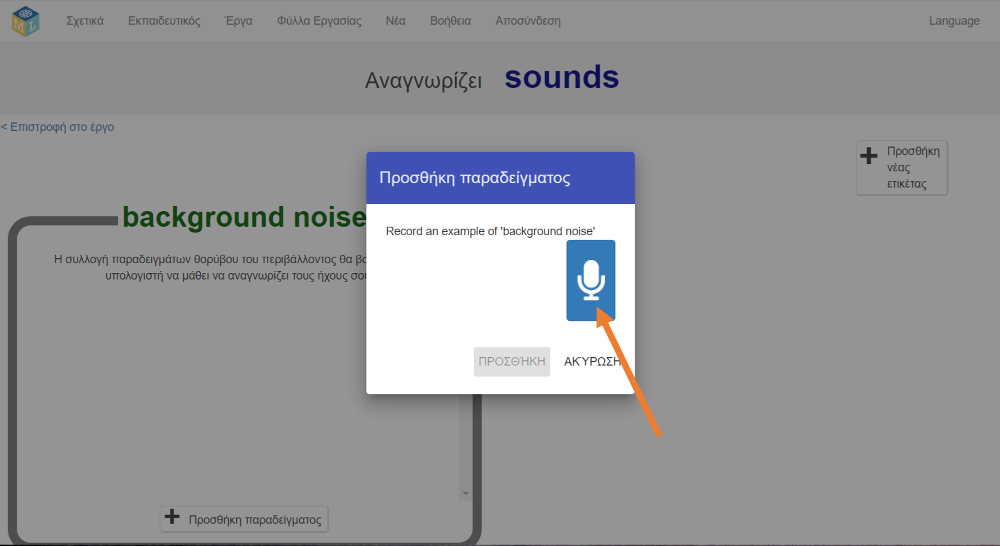
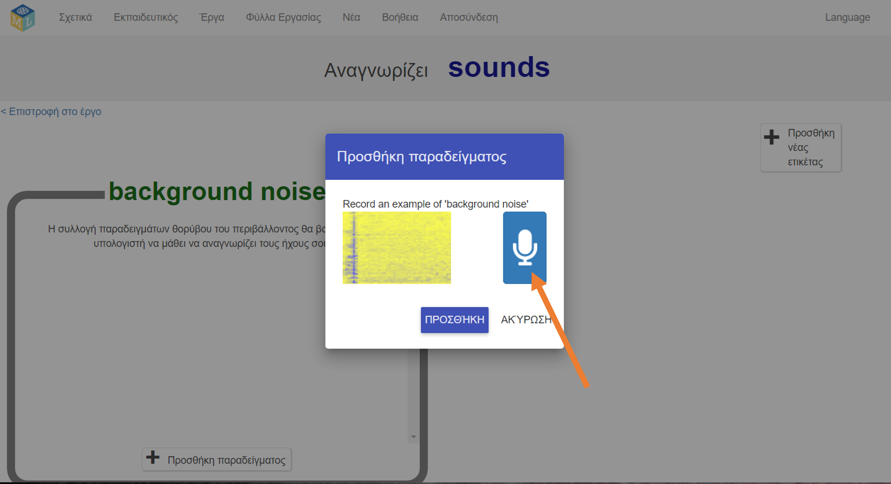
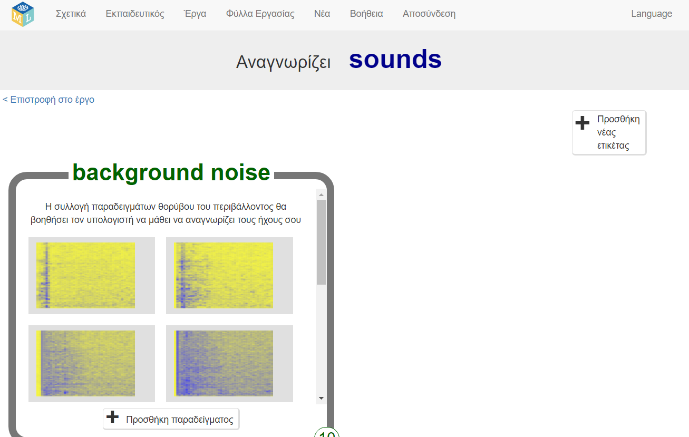
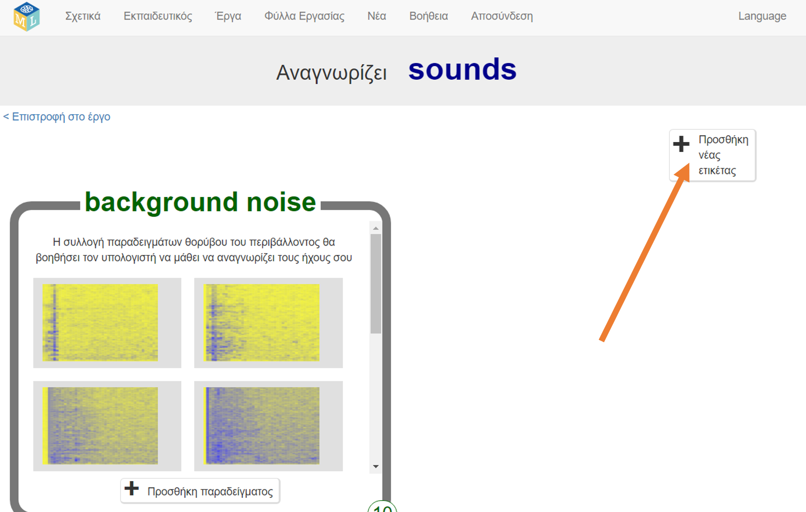
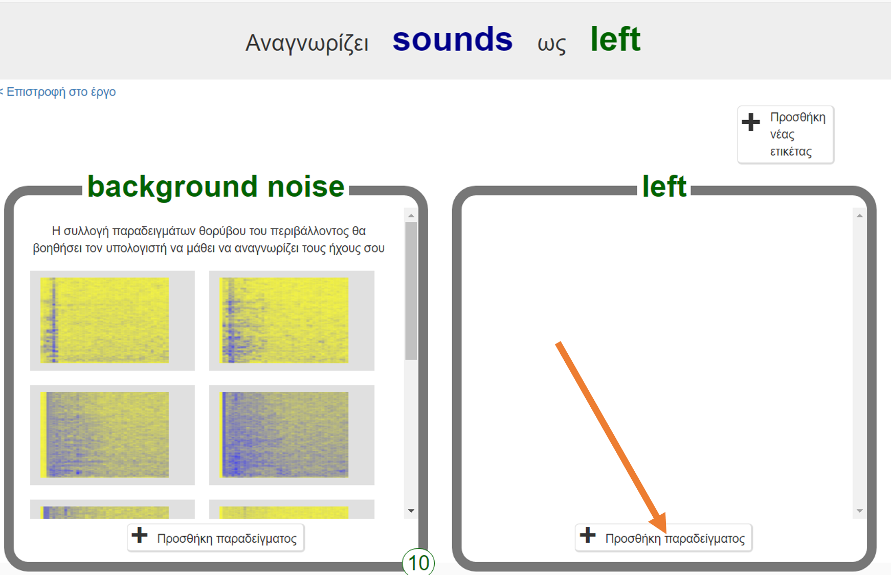
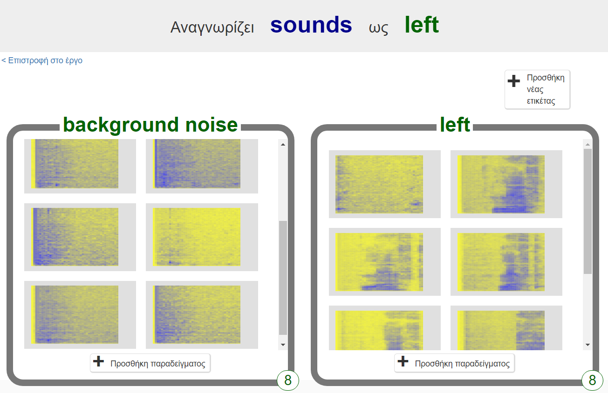
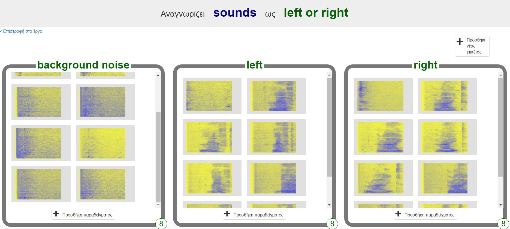

## Δημιουργία ξένων λέξεων
Σε αυτό το βήμα, θα επινοήσεις τις εξωγήινες λέξεις σου.

--- task ---

Χρειάζεσαι δύο λέξεις - μια εξωγήινη λέξη για το "αριστερά" και μια εξωγήινη λέξη για το "δεξιά". Επινόησε δύο νέες λέξεις που δε βρίσκονται σε ένα αγγλικό λεξικό. Μπορεί να είναι τυχαίοι θόρυβοι, εφ 'όσον μπορείς να τις επαναλάβεις με τον ίδιο τρόπο κάθε φορά και είναι αναγνωρίσιμα διαφορετικές μεταξύ τους. Εάν δεν θέλεις να κάνεις θορύβους με τη φωνή σου, αυτό είναι εντάξει - μπορείς να βρεις άλλους τρόπους για να κάνεις θορύβους. Μπορείς να κάνεις κλικ με τα δάχτυλά σου, να χτυπήσεις τα χέρια σου, να συμπιέσεις ένα φουσκωτό παιχνίδι ή να κάνεις ο,τιδήποτε άλλο μπορείς να σκεφτείς! Απλά βεβαιώσου ότι θυμάσαι τα νέα σου λόγια!

--- /task ---

--- task ---

+ Κάνε κλικ στο κουμπί **Εκπαίδευση** για να ξεκινήσεις να συλλέγεις δείγματα. 

+ Κάνε κλικ στο πλήκτρο **Προσθήκη παραδείγματος** στην περιοχή **background noise**. Η εγγραφή θορύβου παρασκηνίου θα βοηθήσει το μοντέλο εκμάθησης της μηχανής σου να βρίσκει τη διαφορά μεταξύ των ήχων που θα εκπαιδεύσεις για να αναγνωρίζει και του θορύβου του χώρου που βρίσκεσαι. 

+ Κάνε κλικ στο μικρόφωνο για να εγγράψεις 2 δευτερόλεπτα θορύβου υπόβαθρου. 

+ Κάνε κλικ στο πλήκτρο **Προσθήκη** για να αποθηκεύσεις την εγγραφή σου. 

+ Επανάλαβε αυτά τα βήματα έως ότου έχεις **τουλάχιστον 8 παραδείγματα** θορύβου υπόβαθρου. 

--- /task ---

--- task ---

+ Κάνε κλικ στο **Προσθήκη νέας ετικέτας** στην πάνω δεξιά γωνία, και δημιούργησε ένα νέο σύνολο εκπαίδευσης που λέγεται `left` (αριστερά). 

+ Κάνε κλικ στο πλήκτρο **Προσθήκη παραδείγματος** στο νέο χώρο **left**. 

+ Κατάγραψε **τουλάχιστον 8 παραδείγματα** της εξωγήινης λέξης για το "αριστερά". 

--- /task ---

--- task ---

+ Κάνε ξανά κλικ στο **Προσθήκη νέας ετικέτας** στην πάνω δεξιά γωνία, και δημιούργησε ένα νέο σύνολο εκπαίδευσης που λέγεται `right` (δεξιά).

+ Κάνε κλικ στο πλήκτρο **Προσθήκη παραδείγματος** στην περιοχή **right**.

+ Κατάγραψε **τουλάχιστον 8 παραδείγματα** της εξωγήινης λέξης για το "δεξιά". 

+ **Σημείωση:** Στο τέλος αυτού του βήματος, θα πρέπει να έχεις τουλάχιστον οκτώ παραδείγματα σε κάθε ένα από τα τρία σύνολα.

--- /task ---
