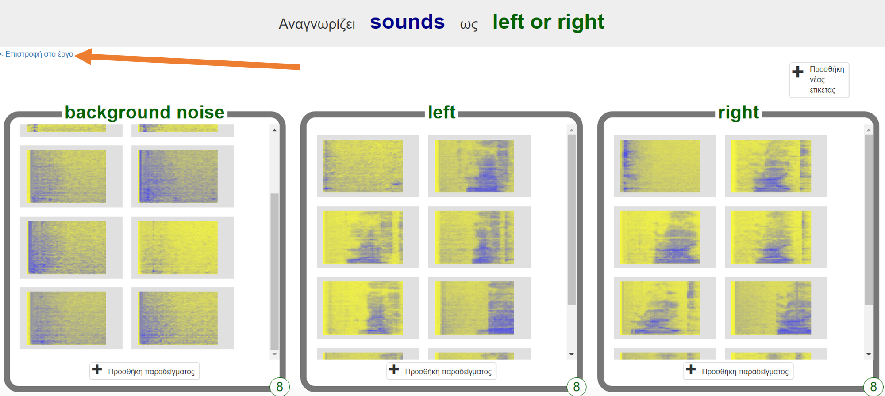
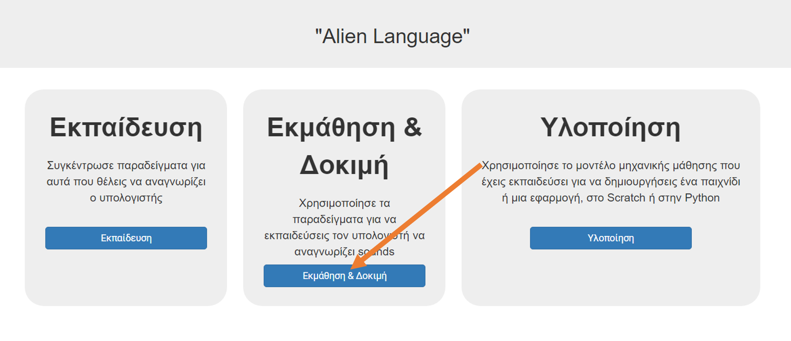
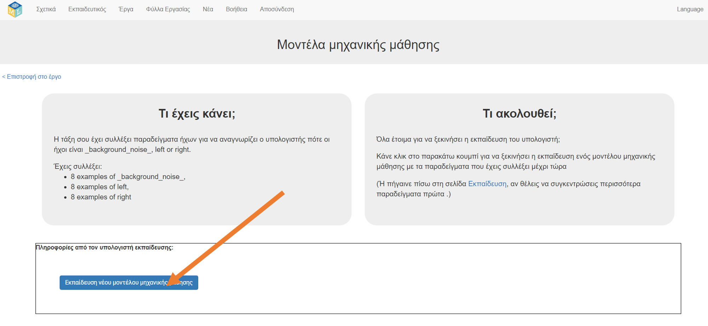
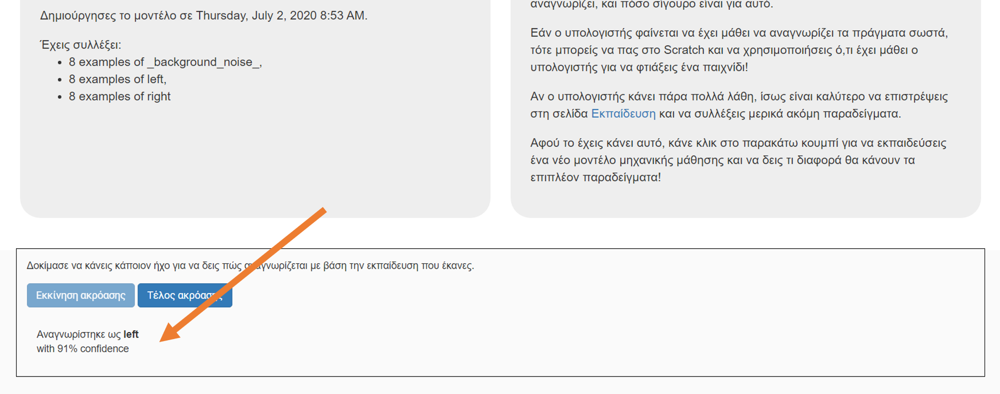

## Εκπαίδευσε ένα νέο μοντέλο μηχανικής μάθησης
Σε αυτό το βήμα, θα χρησιμοποιήσεις τα παραδείγματα που δημιούργησες στο τελευταίο βήμα για να εκπαιδεύσεις τον υπολογιστή πώς να αναγνωρίζει τις νέες λέξεις.

--- task ---

+ Κάνε κλικ στον σύνδεσμο **Επιστροφή στο έργο** στην επάνω αριστερή γωνία. 

+ Κάνε κλικ στο κουμπί **Εκμάθηση & Δοκιμή**. 

+ Κάνε κλικ στο **Εκπαίδευση νέου μοντέλου μηχανικής μάθησης**. Αυτό μπορεί να διαρκέσει μερικά λεπτά για να ολοκληρωθεί. 

--- /task ---

--- task ---

+ Μόλις τελειώσει η εκπαίδευση, κάνε κλικ στο πλήκτρο **Εκκίνηση ακρόασης** για να ελέγξεις το μοντέλο μηχανικής μάθησης. Πες μία από τις λέξεις (ή κάνε έναν από τους ήχους) που έχεις εκπαιδεύσει τον υπολογιστή σου να αναγνωρίζει ως "αριστερά" ή "δεξιά". Αν το μοντέλο της μηχανικής μάθησης το αναγνωρίσει, θα εμφανίσει αυτό που νομίζει ότι είπες. 

+ Αν δεν είσαι ευχαριστημένος με το πώς το μοντέλο λειτουργεί, πήγαινε πίσω στην **Εκπαίδευση** και πρόσθεσε περισσότερα παραδείγματα στα τρία σύνολα εκπαίδευσης.

+ Όταν είσαι ικανοποιημένος με το μοντέλο μηχανικής μάθησης, προχώρησε στο επόμενο βήμα.

--- /task ---
