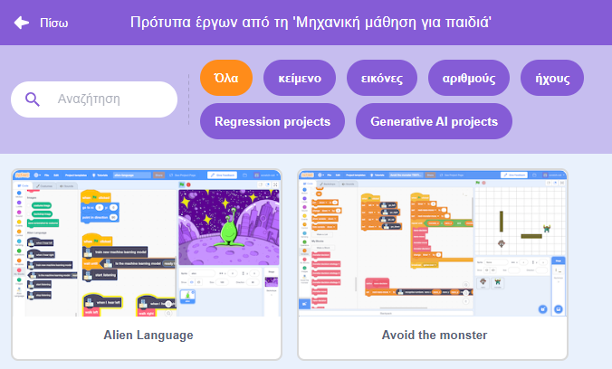
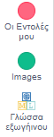
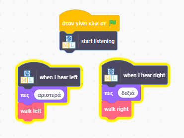

## Έλεγξε τον εξωγήινο

<html>
  

    <iframe style="position: absolute; top: 0; left: 0; right: 0; width: 100%; height: 100%; border: none;" src="https://www.youtube.com/embed/cAovIpUuiGo?rel=0&cc_load_policy=1" allowfullscreen allow="accelerometer; autoplay; clipboard-write; encrypted-media; gyroscope; picture-in-picture; web-share"></iframe>
  

</html>

Τώρα που το μοντέλο σου μπορεί να διακρίνει μεταξύ λέξεων, μπορείς να το χρησιμοποιήσεις σε ένα πρόγραμμα Scratch για να ελέγξεις έναν εξωγήινο.

--- task ---

+ Κάνε κλικ στον σύνδεσμο **Επιστροφή στο έργο**.

+ Κάνε κλικ στο **Υλοποίηση**.

+ Κάνε κλικ στο **Scratch 3**.

+ Κάνε κλικ στο **Άνοιγμα στο Scratch 3**.

--- /task ---

--- task ---

+ Κάνε κλικ στα **Πρότυπα έργων** στην κορυφή και επίλεξε το έργο «Alien language» για να φορτώσεις το αντικείμενο alien, στο οποίο έχει ήδη προστεθεί κάποιος κώδικας.

--- /task ---

Το Machine Learning for Kids έχει προσθέσει ορισμένα ειδικά μπλοκ στο Scratch για να σου επιτρέψει να χρησιμοποιήσεις το μοντέλο που μόλις εκπαίδευσες. Αυτό το πρότυπο έργου περιέχει επίσης ειδικά μπλοκ «walk left» και «walk right» μέσα στο μενού «Οι Εντολές μου». Θα τα βρεις στο κάτω μέρος της λίστας των μπλοκ.

--- task ---

+ Βεβαιώσου ότι έχεις επιλέξει το αντικείμενο **Alien** και, στη συνέχεια, κάνε κλικ στην καρτέλα **Κώδικας** και πρόσθεσε αυτόν τον κώδικα. (Διατήρησε τον κώδικα που υπάρχει ήδη!) 

--- /task ---

--- task ---

+ Κάνε κλικ στην **πράσινη σημαία** και πες τις εξωγήινες λέξες για το αριστερά και δεξιά. Έλεγξε αν ο εξωγήινος κινείται όπως περιμένεις.

--- /task ---

