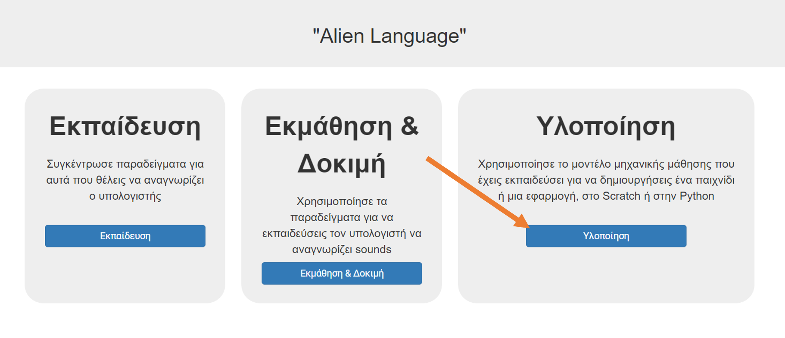
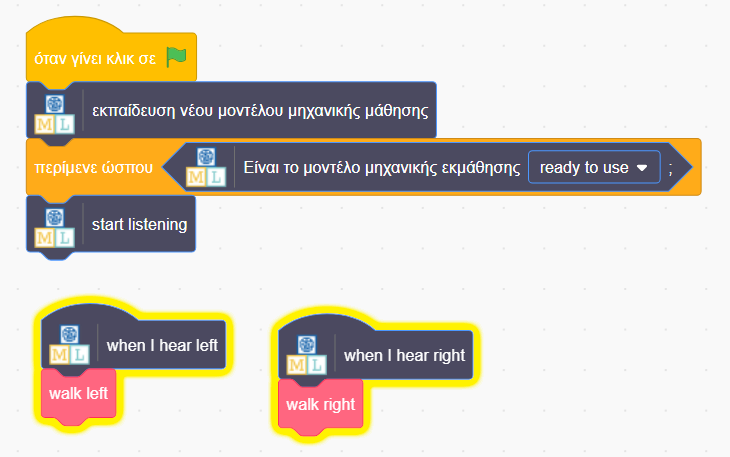

## Χρησιμοποίησε εξωγήινες λέξεις στο Scratch
Σε αυτό το βήμα, θα χρησιμοποιήσεις τη νέα σου μηχανική μάθηση στο Scratch.

--- task ---

+ Κάνε κλικ στο κουμπί **Υλοποίηση**. 

+ Κάνε κλικ στο κουμπί **Scratch 3**, στη συνέχεια κάνε κλικ στο **Άνοιγμα στο Scratch 3**.

+ Κάνε κλικ στο **Πρότυπα έργου** στο επάνω μέρος της οθόνης και, στη συνέχεια, άνοιξε το πρότυπο έργου **Alien Language**.

--- /task ---

--- task ---

+ Δες τα σενάρια για το αντικείμενο εξωγήινος. Τα σενάρια που υπάρχουν ήδη θα τοποθετήσουν τον εξωγήινο στη σωστή θέση στην αρχή και θα ζωντανέψουν τον τρόπο που περπατάει. Μην τα διαγράψεις. Πρόσθεσε τον κώδικα παρακάτω στον εξωγήινο, κάτω από τα σενάρια που υπάρχουν ήδη. 

+ Τώρα, δοκίμασε το πρόγραμμά σου! Κάνε κλικ στην πράσινη σημαία. Πες τα λόγια σου (ή κάνε τους θορύβους σου) για "αριστερά" και "δεξιά" για να πεις στον εξωγήινο πώς να περπατήσει.

--- /task ---

Τώρα εκπαίδευσες το δικό σου μοντέλο μηχανικής μάθησης για να κάνει αναγνώριση ομιλίας και το χρησιμοποίησες για να ελέγχεις έναν χαρακτήρα στο Scratch. Σε αντίθεση με το προηγούμενο μοντέλο που χρησιμοποίησες νωρίτερα στο έργο, το οποίο είχε εκπαιδευτεί για να αναγνωρίζει δεκάδες χιλιάδες λέξεις, το έχεις εκπαιδεύσει μόνο για να αναγνωρίζει δύο διαφορετικές λέξεις. Ωστόσο, η ιδέα είναι η ίδια.

Έχεις επίσης διαπιστώσει τη σημασία της εκπαίδευσης του μοντέλου μηχανικής μάθησης ώστε να δουλεύει με συγκεκριμένο θόρυβο περιβάλλοντος.

--- task ---

Μπορείς να σκεφτείς ένα παράδειγμα ενός τέτοιου συστήματος που έχεις ξαναδεί πριν; Για παράδειγμα, μερικά αυτοκίνητα χρησιμοποιούν συστήματα αναγνώρισης ομιλίας που έχουν εκπαιδευτεί για να αναγνωρίζουν τις διάφορες εντολές που μπορείς να δώσεις στον υπολογιστή του αυτοκινήτου. Ποια άλλα παραδείγματα έχεις χρησιμοποιήσει;

--- /task ---
