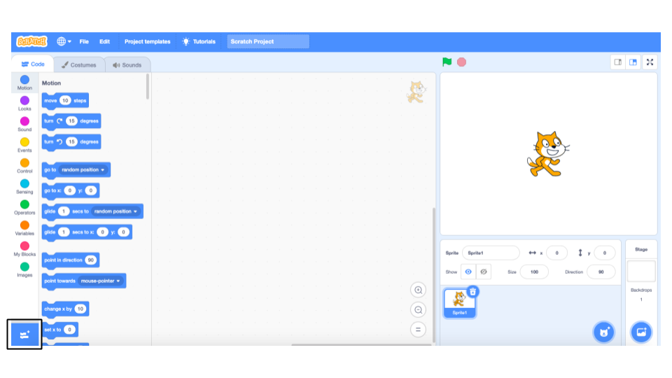
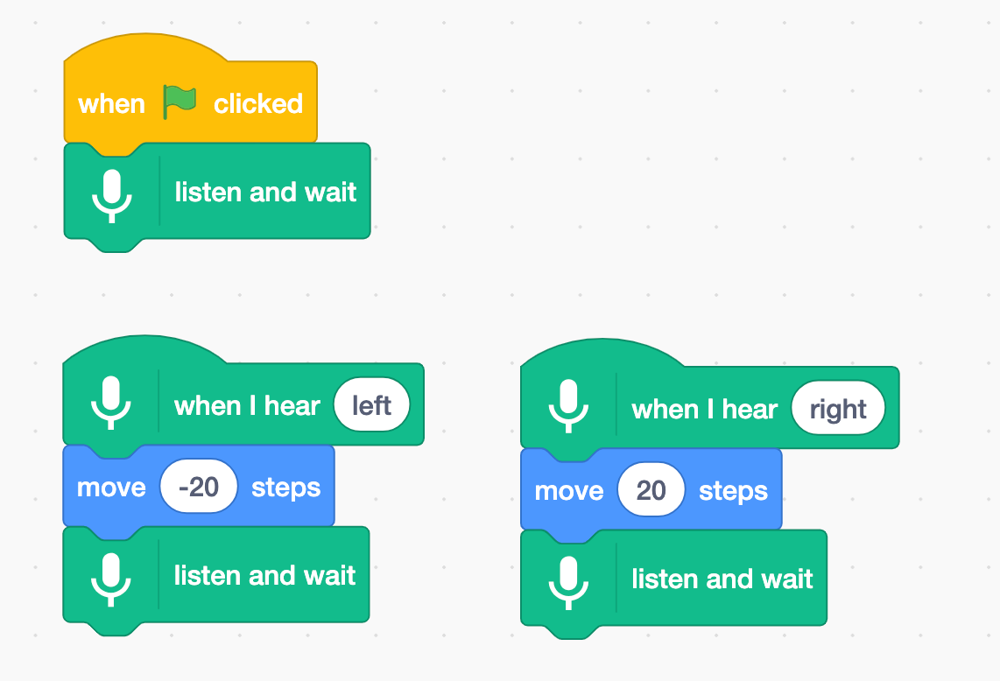

## Using a pretrained model

--- task ---
+ Go to [machinelearningforkids.co.uk/scratch3](https://machinelearningforkids.co.uk/scratch3/){:target="_blank"}
--- /task ---

--- task ---
+ Load the **Speech to Text** extension. Click on the Extensions (plus) button in the bottom left, and then choose Speech to Text from the list.
**Don't confuse it with the Text to Speech extension.**

+ Use the new Speech to Text blocks to create the following scripts.

--- /task ---

--- task ---
Click on the **Green Flag** and give it a try.
Say “left” or “right”. The cat should move in the direction that you tell it to. Try and move it back and forth across the screen using your voice. It can be difficult to get it to work. Try to speak calmly and clearly. If it doesn’t work, modify your script, as seen below, to show what it thinks you’re saying

--- /task ---

You’ve used speech recognition to control a character in Scratch. To get this working quickly, you’ve used a machine learning model that has already been trained for you. This is a general machine learning model that has been trained to recognize English dictionary words. 