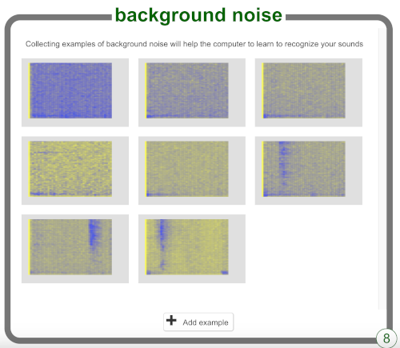

## Invent two words

First, you will collect samples of background noise. This will elp your machine learning model to tell the difference between the sounds that you will train it to recognise, and the background noise where you are.

--- task ---
+ Click the **Add example** button in **background noise**.

+ Click on the microphone to record 2 seconds of background noise.

+ Click the **Add** button to save your recording.
--- /task ---

--- task ---
+ Repeat those steps until you have **at least 8 examples** of background noise.

--- /task ---

Invent two alien words — a word that means "left" and a word that means "right".

Now you will record eight examples of each word so that it can learn to recognise them.

--- task ---
+ Click on **Add new label** and add a label called `left`.
--- /task ---

--- task ---
+ Click on **Add example** and record yourself saying your alien word. 

+ Repeat until you have recorded **at least eight examples** of your alien word for "left".
--- /task ---

--- task ---
+ Create another label called `right` and record eight examples of your alien word for "right". 
--- /task ---
