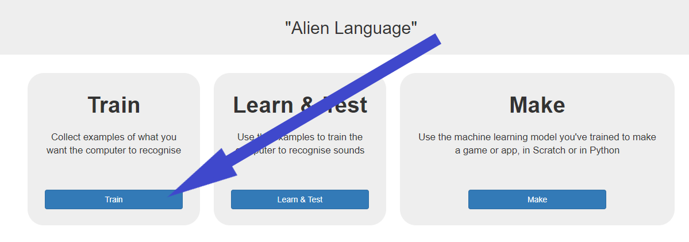
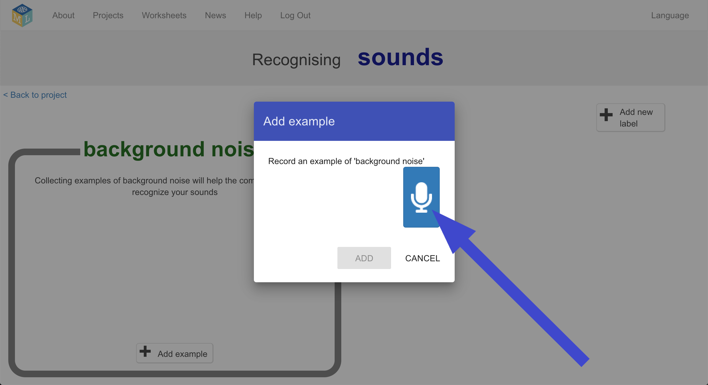
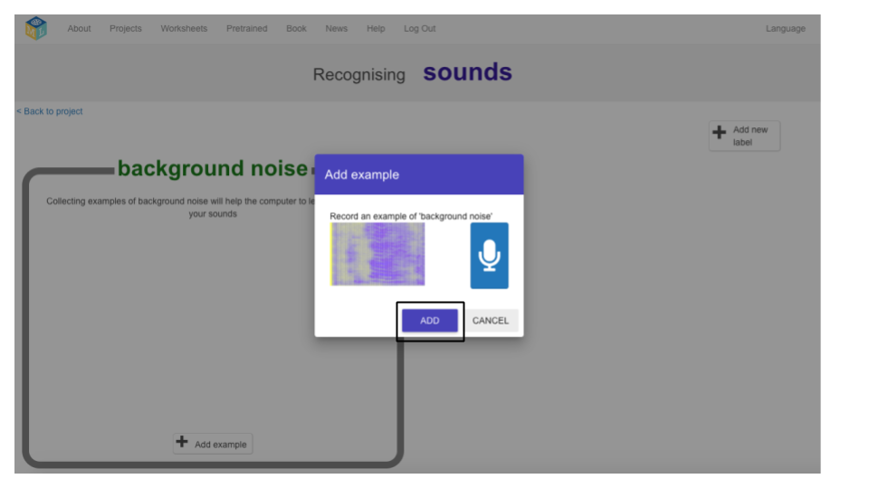
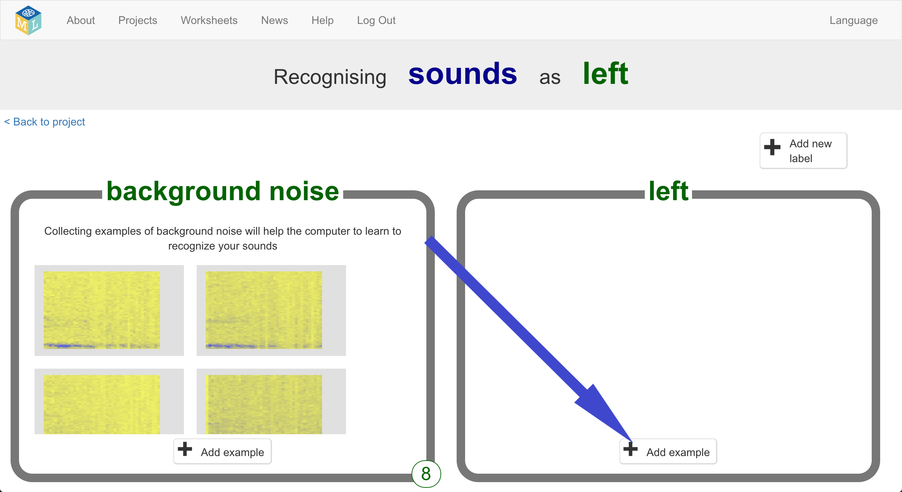

## Create alien words
Now before you go any further, it's time to invent your alien words.

--- task ---

You need two words – an alien word for “left” and an alien word for “right”. Invent new words that wouldn’t show up in an English dictionary. They can be random noises as long as you can repeat them in the same way every time and will be recognisably different from each other. If you don’t want to make weird noises with your voice, that’s okay - find other ways to make noises. You can click your fingers, clap your hands, squeeze a squeaky toy or do anything else you can think of!
**Just be sure to remember your new words**!

--- /task ---

--- task ---

+ Click on the Train button to start collecting examples.

+ Click on the Add example button in the background noise bucket. Recording background noise will help your machine learning model to tell the difference between the sounds you will train it to recognize, and the background noise where you are.

+ Click the microphone to record 2 seconds of background noise

+ Click the Add button to save your recording

+ Repeat that until you have **at least 8** examples of background noise

--- /task ---

--- task ---

+ Click the **Add new label** button in the top right, and create a new
training bucket called “left”

+ Click the **Add example** button in the new left bucket

+ Record **at least 8** examples of your alien noise for “left”

--- /task ---

--- task ---

+ Click the **Add new label** button in the top right again, and create a new
training bucket called “right”

+ Click the **Add example** button in the new right bucket

+ Record **at least 8** examples of your alien noise for “right”

+ **You must have 8 samples for all three buckets to continue!**

--- /task ---