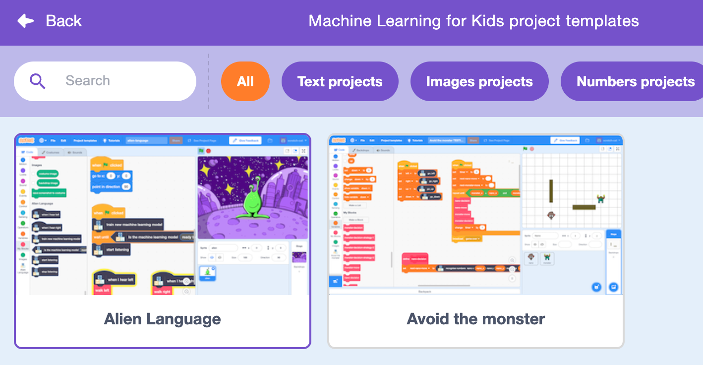
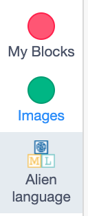
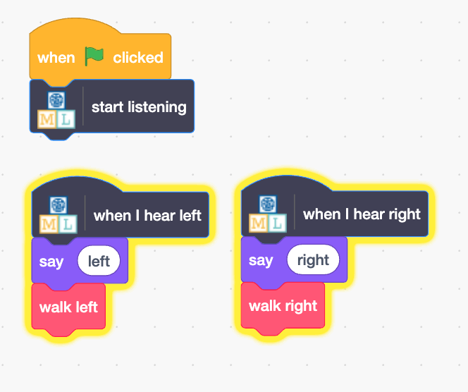

## Control the alien

<html>
  

    <iframe style="position: absolute; top: 0; left: 0; right: 0; width: 100%; height: 100%; border: none;" src="https://www.youtube.com/embed/dRS1bbBqGyg?rel=0&cc_load_policy=1" allowfullscreen allow="accelerometer; autoplay; clipboard-write; encrypted-media; gyroscope; picture-in-picture; web-share"></iframe>
  

</html>

Now that your model can distinguish between words, you can use it in a Scratch program to control an alien.

--- task ---
+ Click on the **< Back to project** link.

+ Click on **Make**.

+ Click on **Scratch 3**.

+ Click on **Open in Scratch 3**.

--- /task ---

--- task ---
+ Click on **Project templates** at the top and select the 'Alien language' project to load the alien sprite, which already has some code added. 

--- /task ---

Machine Learning for Kids has added some special blocks to Scratch to allow you to use the model you just trained. This project template also contains special 'walk left' and 'walk right' blocks inside "My Blocks". Find both at the bottom of the blocks list.

--- task ---

+ Make sure you have the **Alien** sprite selected, then click on the **Code** tab and add this code. (Keep the code that is already there!)

--- /task ---

--- task ---
+ Click the **green flag** and say your alien words for "left" and "right". Check that the alien moves the way you expected. 

--- /task ---

