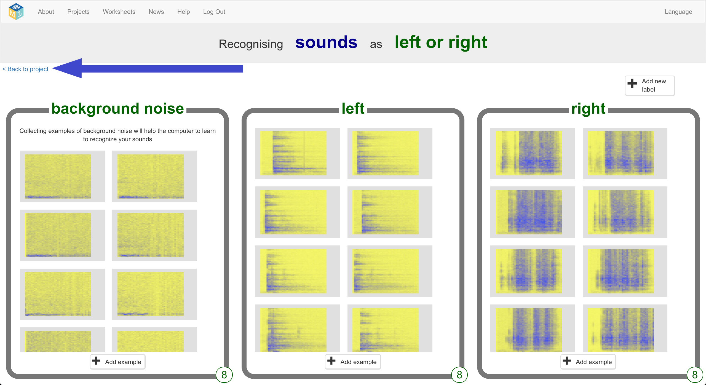

## Train new machine learning model
Now you need to use the examples you collected in the last step to train the computer how to recognise your new words.

--- task ---

+ Click the **“Back to project”** link in the top left

+ Click the **Learn & Test** button

* Click **“Train new machine learning model”** 
This may take a couple of minutes.

--- /task ---

--- task ---

+ Once the training is finished, click the **Start listening** button to test your machine learning model. Make one of the sounds you’ve trained the computer to recognize as meaning “left” or “right”. If your machine learning model recognizes it, it will display what it thinks you did.

+ If you’re not happy with how the model is working, go back to the **Train** page and add more examples to all three training buckets.

+ When you’re happy with your machine learning model, move on to the next step.

--- /task ---