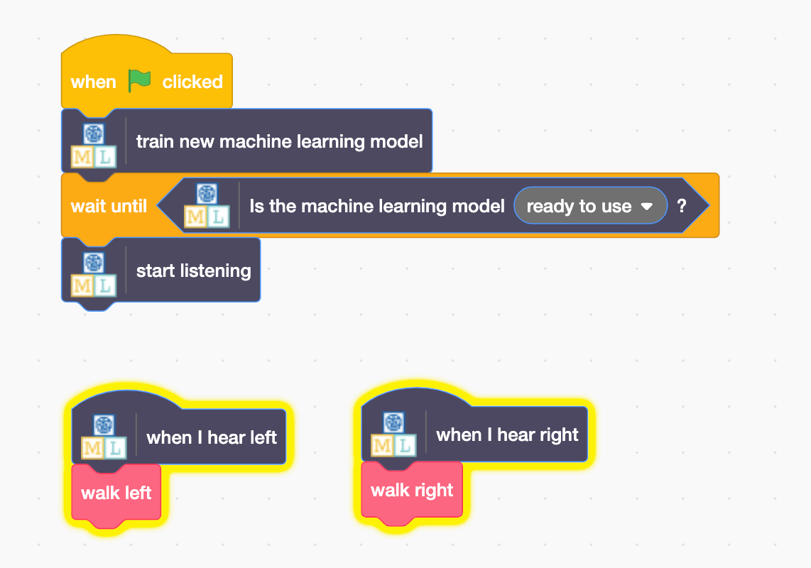

## Use Alien words in Scratch
Now let's use your new machine learning in Scratch
--- task ---
+ Click on the **Make** button

+ Click on the Scratch 3 button and then click Open in Scratch 3

+ Click on the **Project templates** button at the top of the screen and
open the “Alien Language” project template
--- /task ---

--- task ---
+ Add the following script to the **alien** sprite. There are already some scripts in the alien sprite to put it in the right place at the start and animate how it walks. **Don’t delete these.** You can add these scripts underneath them.

+ It’s time to test! Click the **Green Flag** Make your noises for “left” and “right” to tell the alien which way to walk.

--- /task ---

You’ve trained your own machine learning model to do speech recognition. You used that to control a character in Scratch.
Unlike the pre-trained model you used before, which has been trained to recognize tens of thousands of words, you’ve only trained it to recognize two different words. But the principle is the same.
You’ve also seen the importance of training the machine learning model to work with a certain background noise.
Can you think of an example of a system like this you’ve seen used before? For example, some cars use speech recognition systems that have been trained to recognize the different commands you can give to the incar computer. What other examples have you used?