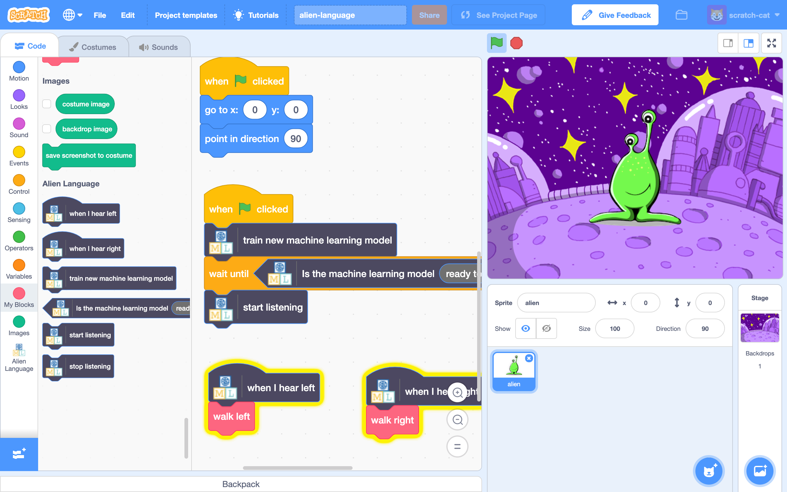

## Introducción

En este proyecto, entrenarás a la computadora para que entienda un idioma alienígena. Lo usarás para controlar a un personaje alienígena, de tal manera que pueda entender lo que le digas que haga.

### Lo que harás

--- no-print ---

--- /no-print ---

--- print-only ---

--- /print-only ---

--- collapse ---
---
title: Lo que necesitarás
---

+ Una computadora con un micrófono

+ Conexión a Internet

--- /collapse ---

--- collapse ---
---
title: Lo que aprenderás
---
+ Cómo usar la extensión de Reconocimiento de voz en Scratch 3 con un modelo preentrenado
+ Cómo entrenar un modelo de aprendizaje automático para reconocer sonidos
+ Cómo usar tu propio modelo de aprendizaje automático entrenado en Scratch 3

--- /collapse ---

--- collapse ---
---
title: Información adicional para educadores
---

Si necesitas imprimir este proyecto, usa la [versión para imprimir](https://projects.raspberrypi.org/es-LA/projects/alien-language/print){:target="_blank"}.

--- /collapse ---

### Licencia

Este proyecto actúa bajo una doble licencia: [Creative Commons Attribution Non-Commercial Share-Alike License](http://creativecommons.org/licenses/by-nc-sa/4.0/){:target="_blank"} y [Apache License Version 2.0](http://www.apache.org/licenses/LICENSE-2.0){:target="_blank"}

Nos gustaría dar las gracias a Dale de machinelearningforkids.co.uk por todo su trabajo en este proyecto.
