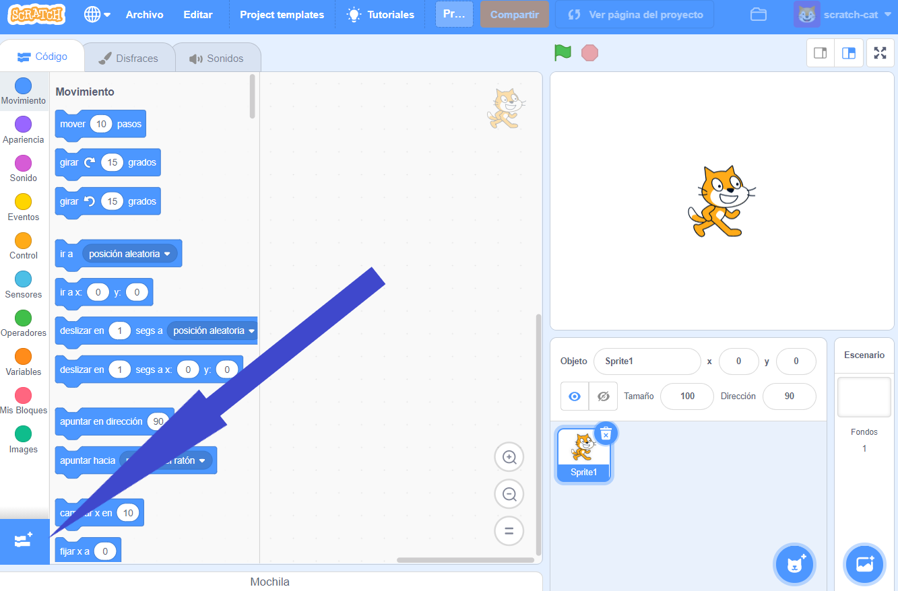
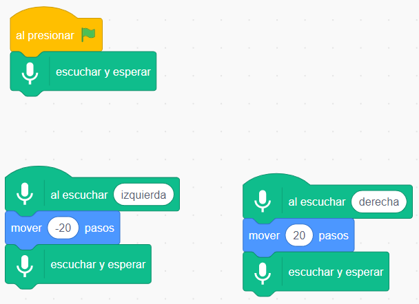
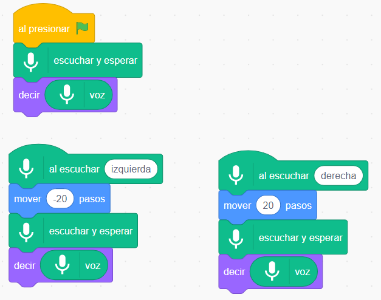

## Usa un modelo preentrenado

--- task ---
+ Ve a [machinelearningforkids.co.uk/scratch3](https://machinelearningforkids.co.uk/scratch3/){:target="_blank"}
--- /task ---

**Advertencia:** Este paso del proyecto solo se puede completar usando el navegador web Google Chrome. Si no dispones de este navegador, ve al [paso 3: Crea un nuevo proyecto](https://projects.raspberrypi.org/es-LA/projects/alien-language/3)

--- task ---
+ Luego, carga la extensión **Reconocimiento de voz**. Nota: Puede aparecerte en inglés como "Speech to Text". Haz clic en el botón **Añadir Extensión** en la esquina inferior izquierda y luego elige **Reconocimiento de voz** de la lista. **Nota:** Asegúrate de seleccionar la extensión **Reconocimiento de voz ("Speech to Text")**, no la extensión **Texto a voz**. 

+ Usa los bloques de **Eventos**, **Movimientos** y los nuevos bloques de **Reconocimiento de voz** para crear los siguientes bloques de código. 

--- /task ---

--- task --- Haz clic en la bandera verde para probar tu código. Di "izquierda" (left) o "derecha" (right). El gato Scratch debe moverse en la dirección que le pidas. Usa tu voz para intentar mover el gato Scratch de un lado a otro de la pantalla. Intenta hablar con calma y claridad.

Puede ser difícil hacer que funcione. Si no funciona, añade bloques `decir` para que tu código se vea como el que aparece a continuación, y muestre lo que el programa cree que estás diciendo.  --- /task ---

Acabas de utilizar el reconocimiento de voz para controlar un personaje en Scratch.

En este paso, para que tu programa funcionara rápidamente, utilizaste un modelo de aprendizaje automático que ya había sido entrenado previamente para ti. Es un modelo general de aprendizaje automático que ha sido entrenado para reconocer palabras de un diccionario en inglés. 
