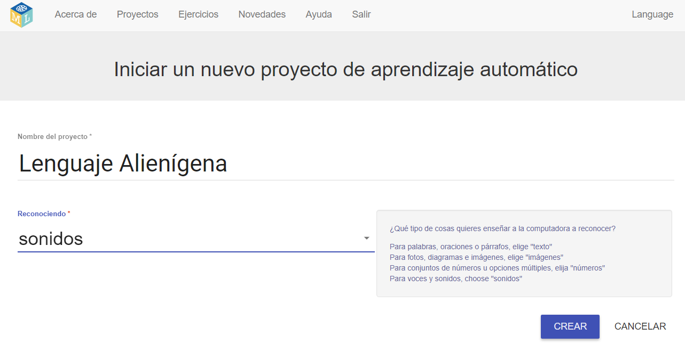

## Crea un nuevo proyecto
En los próximos pasos, entrenarás un modelo de aprendizaje automático para que veas cómo se hizo. ¡Para la próxima parte del proyecto, usarás tu voz para controlar a un personaje alienígena que no entiende inglés! Inventarás dos palabras nuevas que no se encuentran en un diccionario en inglés. Luego, usarás las palabras para controlar el personaje alienígena y entrenarás un modelo de aprendizaje automático para reconocerlas.

Primero, ve al sitio web Machine Learning for Kids y crea un proyecto.

--- task ---
+ Ve a [machinelearningforkids.co.uk](https://machinelearningforkids.co.uk/){: target = "_ blank"}.

+ Haz clic en **Empezar**.

+ Haz clic en **Pruébalo ahora**. --- /task ---

--- task ---
+ Haz clic en **Proyectos** en la barra de menú en la parte superior de la página.

+ Haz clic en el botón **Añadir un nuevo proyecto**.

+ Nombra tu proyecto como `Lenguaje Alienígena` y configúralo para aprender a reconocer `sonidos`. Luego, haz clic en el botón **Crear**. 

+ Deberías ver `Lenguaje Alienígena` en la lista de proyectos. Haz clic en el proyecto `Lenguaje Alienígena`. --- /task ---
