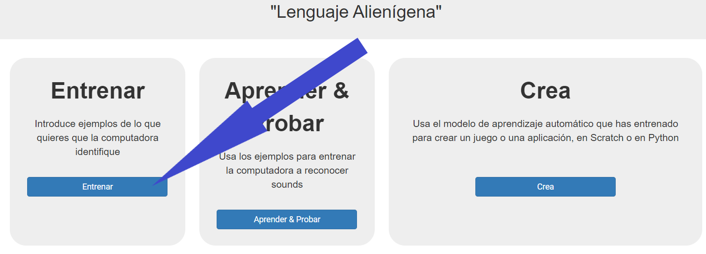
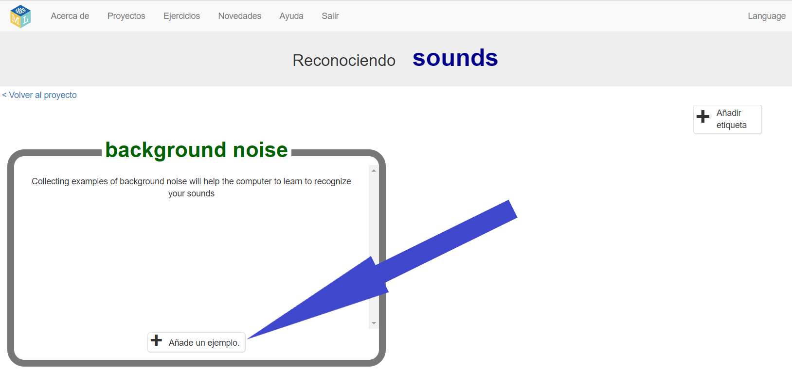
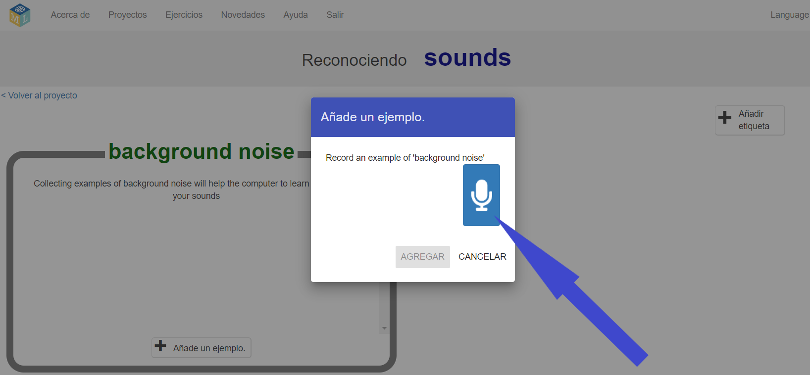
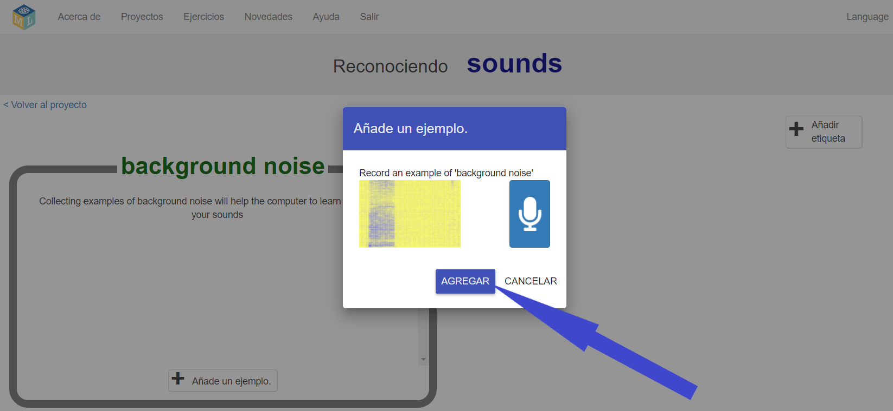
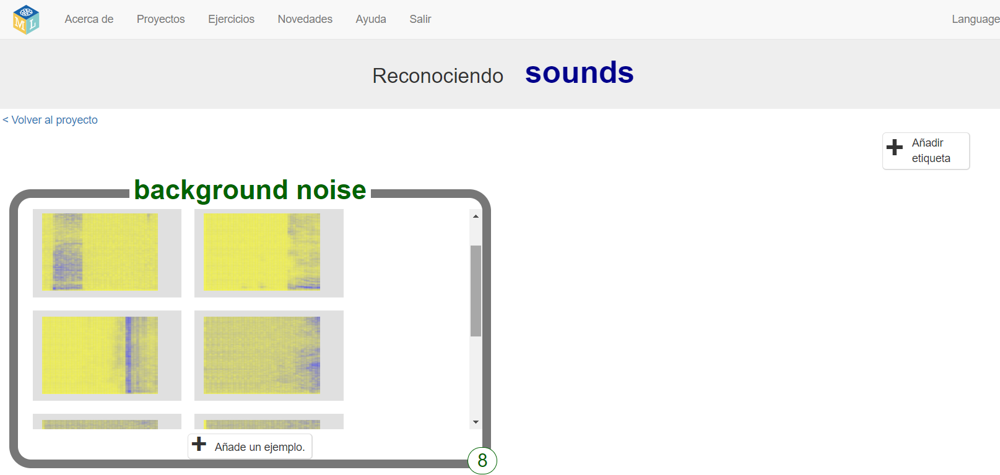
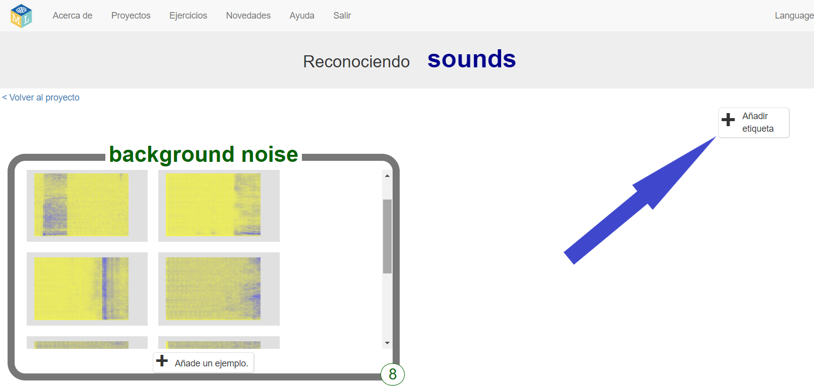
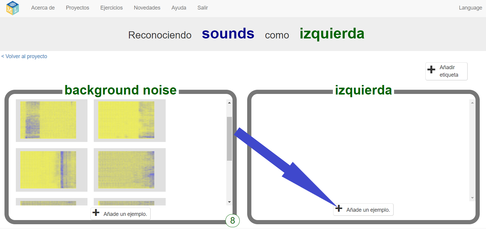
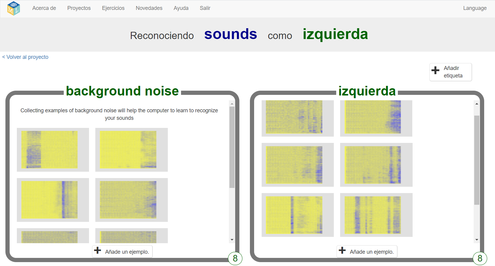
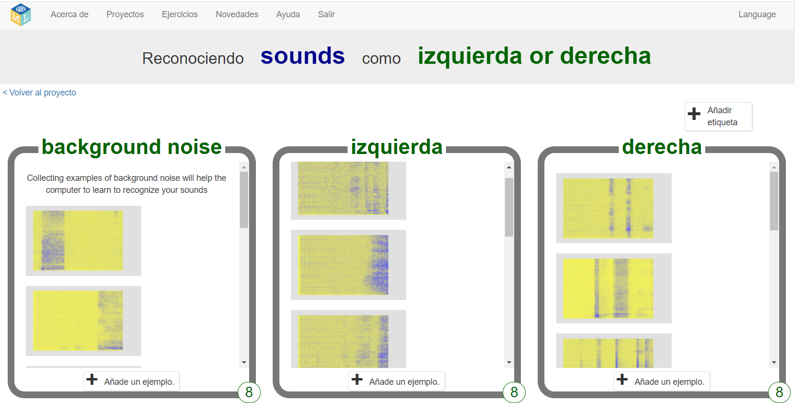

## Crea palabras alienígenas
En este paso, inventarás tus palabras alienígenas.

--- task ---

Necesitarás dos palabras: una palabra alienígena para "izquierda" y otra para "derecha". Inventarás dos palabras nuevas que no se encuentran en un diccionario en inglés. Pueden ser ruidos aleatorios, siempre que puedas repetirlos de la misma manera cada vez y sean claramente diferentes entre sí. Si no deseas hacer ruidos con tu voz, está bien, puedes encontrar otras formas de hacerlos. ¡Puedes chasquear los dedos, aplaudir, apretar un juguete que chille o hacer cualquier otra cosa que se te ocurra! ¡Solo asegúrate de recordar tus nuevas palabras!

--- /task ---

--- task ---

+ Haz clic en el botón **Entrenar** para comenzar a recopilar ejemplos. 

+ Haz clic en el botón **Añade un ejemplo** dentro del contenedor **background noise (o Ruido de fondo)**. La grabación de ruido de fondo ayudará a tu modelo de aprendizaje automático a diferenciar entre los sonidos con los que se le entrenará para que los reconozca y el ruido de fondo de donde te encuentras. 

+ Haz clic en el micrófono para grabar 2 segundos de ruido de fondo. 

+ Haz clic en el botón **Agregar** para guardar tu grabación. 

+ Repite estos pasos hasta que tengas **al menos 8 ejemplos** de ruido de fondo. 

--- /task ---

--- task ---

+ Haz clic en el botón **Añadir etiqueta** en la esquina superior derecha y crea un nuevo contenedor de entrenamiento llamado `izquierda`. 

+ Haga clic en el botón **Añade un ejemplo** en el nuevo contenedor para **izquierda**. 

+ Graba **al menos 8 ejemplos** de tu palabra alienígena para "izquierda". 

--- /task ---

--- task ---

+ Vuelve a hacer clic en el botón **Añadir etiqueta** en la esquina superior derecha y crea un nuevo contenedor de entrenamiento llamado `derecha`.

+ Haz clic en el botón **Añade un ejemplo** en el nuevo contenedor para **derecha**.

+ Graba **al menos 8 ejemplos** de tu palabra alienígena para "derecha". 

+ **Nota:** Al final de este paso, debes tener ocho ejemplos en cada uno de los tres contenedores.

--- /task ---
