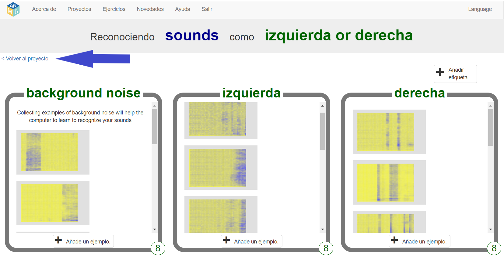
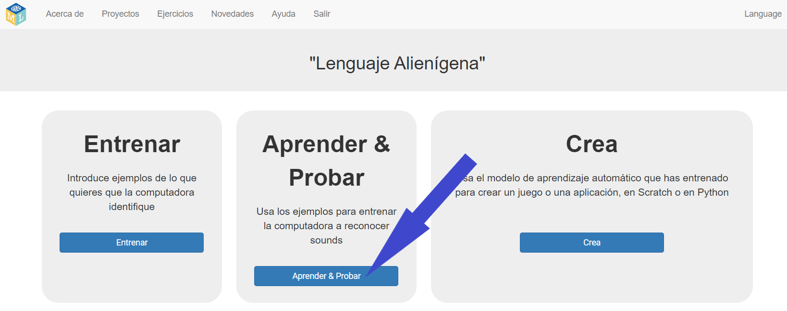
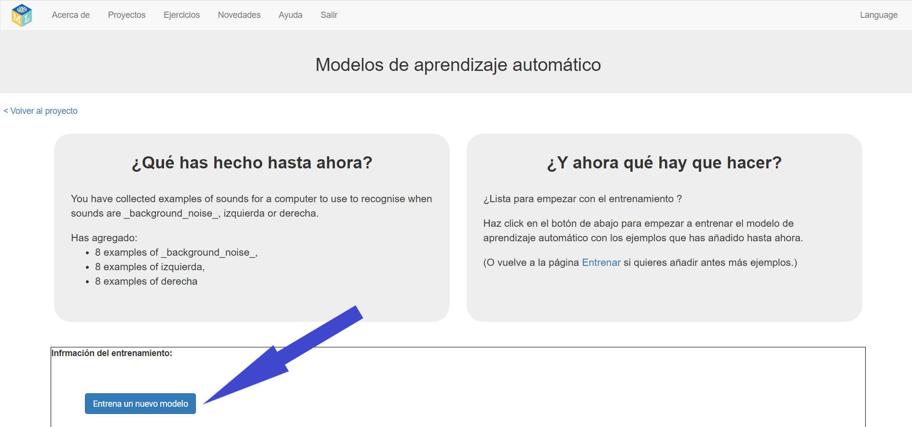
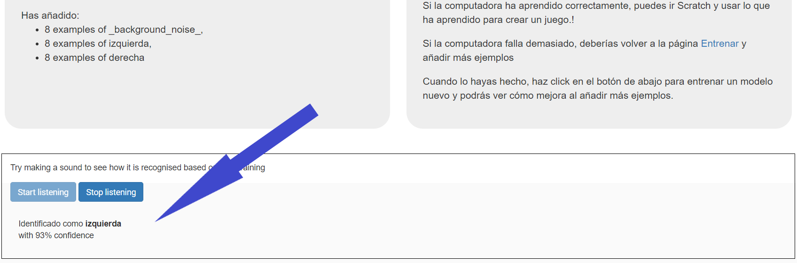

## Train a new machine learning model
In this step, you will use the examples that you collected in the last step to train the computer how to recognise your new words.

--- task ---

+ Click the **Back to project** link in the top left-hand corner. 

+ Click the **Learn & Test** button. 

+ Click on **Train new machine learning model**. This may take a few minutes to complete. 

--- /task ---

--- task ---

+ Once the training has finished, click the **Start listening** button to test your machine learning model. Say one of the words (or make one of the sounds) that you have trained the computer to recognise as “left” or “right”. If your machine learning model recognises it, it will display what it thinks you said. 

+ If you are not happy with how the model is working, go back to the **Train** page and add more examples to all three training buckets.

+ When you are happy with your machine learning model, move on to the next step.

--- /task ---
