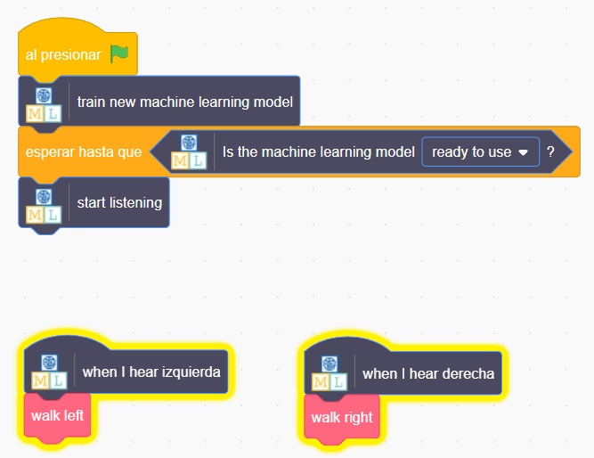

## Usa palabras alienígenas en Scratch
En este paso, utilizarás tu nuevo aprendizaje automático en Scratch.

--- task ---

+ Haz clic en el botón **Crea**. Nota: está en la página principal del proyecto. 

+ Haz clic en el botón **Scratch 3**, luego haz clic en **Abrir en Scratch 3**.

+ Haz clic en ** Plantillas de proyecto ** en la parte superior de la pantalla, luego abre la plantilla de proyecto **Lenguaje alienígena**.

--- /task ---

--- task ---

+ Mira el código para el objeto alienígena. Los bloques de código que ya están allí colocarán al objeto alienígena al comienzo en el lugar correcto y animarán su forma de caminar. No los elimines. Añade el código que se muestra a continuación al objeto alienígena, debajo de los bloques de código que ya están allí. 

+ ¡Ahora, prueba tu programa! Haz clic en la bandera verde. Nota: espera un poco hasta que el modelo de aprendizaje este listo. Di tus palabras (o haz tus ruidos) para "izquierda" y "derecha" para decirle al alienígena qué camino tomar.

--- /task ---

Ahora has entrenado tu propio modelo de aprendizaje automático para hacer reconocimiento de voz y lo has utilizado para controlar un personaje en Scratch. A diferencia del modelo preentrenado que utilizaste anteriormente en el proyecto, que había sido entrenado para reconocer decenas de miles de palabras, este solo lo has entrenado para reconocer dos palabras diferentes. Sin embargo, el principio es el mismo.

También has visto la importancia de entrenar el modelo de aprendizaje automático para trabajar con algo de ruido de fondo.

--- task ---

¿Puedes pensar en un ejemplo de un sistema como este que hayas visto antes? Por ejemplo, algunos automóviles usan sistemas de reconocimiento de voz que han sido entrenados para reconocer los diferentes comandos que se le pueden dar a la computadora del automóvil. ¿Qué otros ejemplos has usado?

--- /task ---
