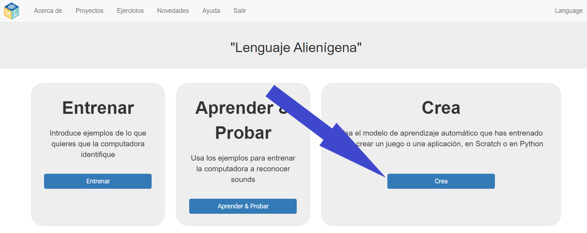

## Use alien words in Scratch
In this step, you will use your new machine learning in Scratch.

--- task ---

+ Click the **Make** button. 

+ Click the **Scratch 3** button, then click on **Open in Scratch 3**.

+ Click on **Project templates** at the top of the screen, then open the **Alien Language** project template.

--- /task ---

--- task ---

+ Look at the scripts for the alien sprite. The scripts that are already there will put the alien sprite in the right place at the start and animate how it walks. Do not delete them. Add the script below to the alien sprite, underneath the scripts that are already there. 

+ Now, test your program! Click on the green flag. Say your words (or make your noises) for “left” and “right” to tell the alien which way to walk.

--- /task ---

You have now trained your own machine learning model to do speech recognition, and used that to control a character in Scratch. Unlike the pretrained model that you used earlier in the project, which had been trained to recognise tens of thousands of words, you have only trained it to recognise two different words. However, the principle is the same.

You have also seen the importance of training the machine learning model to work with a certain background noise.

--- task ---

Can you think of an example of a system like this that you have seen before? For example, some cars use speech recognition systems that have been trained to recognise the different commands that you can give to the in-car computer. What other examples have you used?

--- /task ---
