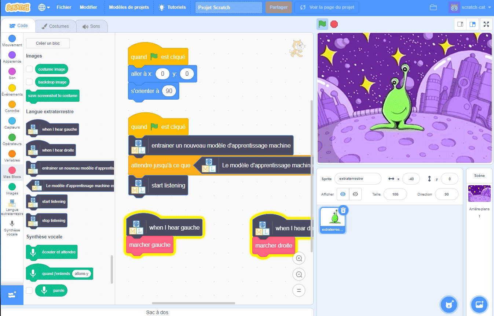

## Introduction

Dans ce projet, tu vas apprendre à l'ordinateur à comprendre une langue extraterrestre. Tu vas utiliser cela pour contrôler un personnage extraterrestre afin qu'il puisse comprendre ce que tu lui dis de faire.

### Ce que tu feras

--- no-print ---

--- /no-print ---

--- print-only ---

--- /print-only ---

--- collapse ---
---
title: Ce qu'il te faut
---

+ Un ordinateur avec un micro

+ Un accès à Internet

--- /collapse ---

--- collapse ---
---
title: Ce que tu vas apprendre
---
+ Comment utiliser l'extension « Synthèse vocale » dans Scratch 3 avec un modèle prédéfini
+ Comment entraîner un modèle d'apprentissage machine pour reconnaître des sons
+ Comment utiliser ton modèle d'apprentissage machine entraîné dans Scratch 3

--- /collapse ---

--- collapse ---
---
title: Informations supplémentaires pour les éducateurs
---

Si vous avez besoin d'imprimer ce projet, merci d'utiliser la [version imprimable](https://projects.raspberrypi.org/fr-FR/projects/alien-language/print){:target="_blank"}.

--- /collapse ---

### Licence

Ce projet fait l'objet d'une double licence, à la fois sous une licence [Creative Commons Attribution, une licence à part égale et non commerciale](http://creativecommons.org/licenses/by-nc-sa/4.0/){:target="_blank"} et une licence [Apache, version 2.0](http://www.apache.org/licenses/LICENSE-2.0){:target="_blank"}

Nous aimerions remercier Dale de machinelearningforkids.co.uk pour tout son travail sur ce projet.
