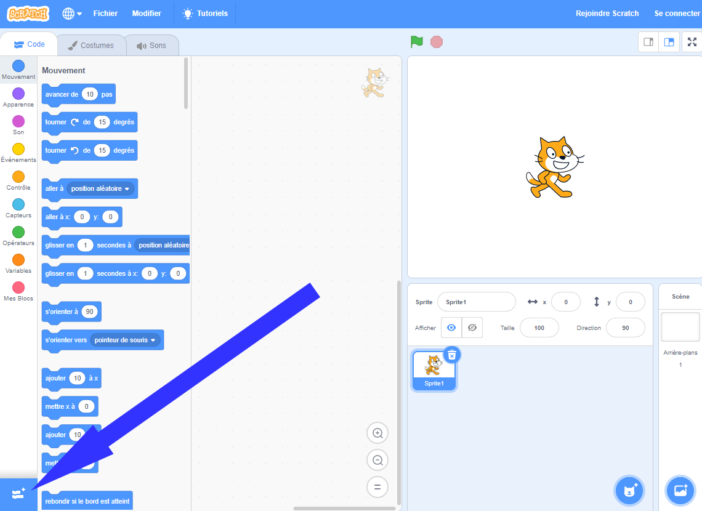
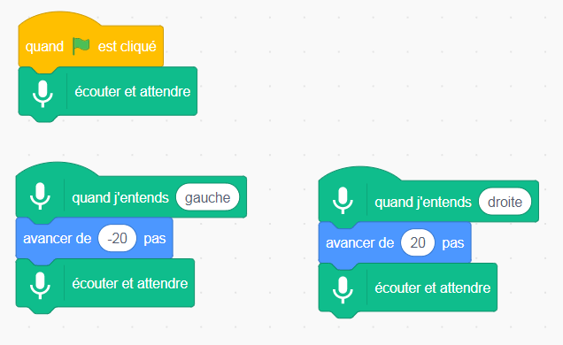
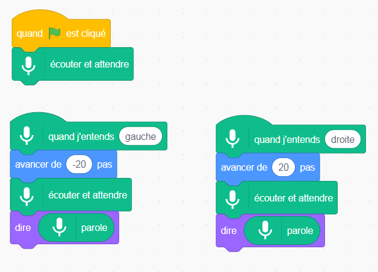

## Utiliser un modèle prédéfini

--- task ---
+ Va sur [machinelearningforkids.co.uk/scratch3](https://machinelearningforkids.co.uk/scratch3/){:target="_blank"}
--- /task ---

**Attention :** Cette étape du projet ne peut être effectuée qu'à l'aide du navigateur Web Google Chrome. Si ce navigateur n'est pas à ta disposition, passe à l'[étape 3 : créer un nouveau projet](https://projects.raspberrypi.org/fr-FR/projects/alien-language/3)

--- task ---
+ Ensuite, charge l'extension **Synthèse vocale**. Clique sur le bouton **Extensions** dans le coin inférieur gauche, puis choisis **Synthèse vocale** dans la liste. **Remarque :** Assure-toi de bien sélectionner l’extension **Synthèse vocale (Google Chrome browsers only)**. 

+ Utilise les blocs **Événements**, les blocs **Mouvement** et les nouveaux blocs **Synthèse vocale** pour créer les scripts suivants. 

--- /task ---

Clique sur le drapeau vert pour tester ton programme. Dire « gauche » ou « droite ». Le chat Scratch doit se déplacer dans la direction que tu lui demandes. Utilise ta voix pour essayer de déplacer le chat Scratch d'avant en arrière sur l'écran. Essaie de parler calmement et clairement.

Çà peut être difficile de le faire fonctionner. Si cela ne fonctionne pas, ajoute les blocs `dire` afin que ton script ressemble au script ci-dessous, pour montrer ce qu'il pense que tu dis.  --- /task ---

Tu as maintenant utilisé la reconnaissance vocale pour contrôler un personnage dans Scratch.

Dans cette étape, pour que ton programme fonctionne rapidement, tu as utilisé un modèle d'apprentissage machine qui avait déjà été entraîné pour toi. Il s'agit d'un modèle d'apprentissage machine général qui a été entraîné pour reconnaître les mots du dictionnaire anglais. 
