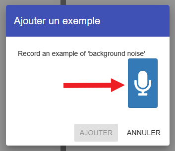

## Inventer deux mots

<html>
  

    <iframe style="position: absolute; top: 0; left: 0; right: 0; width: 100%; height: 100%; border: none;" src="https://www.youtube.com/embed/au4cDSYW_EQ?rel=0&cc_load_policy=1" allowfullscreen allow="accelerometer; autoplay; clipboard-write; encrypted-media; gyroscope; picture-in-picture; web-share"></iframe>
  

</html>

Tout d'abord, tu vas collecter des échantillons de bruit de fond. Cela aidera ton modèle d’apprentissage machine à faire la différence entre les sons que tu vas l’entraîner à reconnaître et le bruit de fond où tu te trouves.

--- task ---

+ Clique sur le bouton **+ Ajouter un exemple** dans **background noise**.

+ Clique sur le microphone, mais ne dis rien. Enregistre 2 secondes de bruit de fond. 

+ Clique sur le bouton **Ajouter** pour enregistrer ton enregistrement.

--- /task ---

--- task ---

+ Répète ces étapes jusqu'à obtenir **au moins huit exemples** de bruit de fond. 

--- /task ---

Invente deux mots extraterrestres : un mot qui signifie « gauche » et un mot qui signifie « droite ».

Tu vas maintenant enregistrer huit exemples pour chaque mot pour que ton modèle d’apprentissage automatique puisse apprendre à les reconnaître.

--- task ---

+ Clique sur **+ Ajouter une nouvelle étiquette** en haut à droite de l'écran et ajoute une étiquette appelée `gauche`.

--- /task ---

--- task ---

+ Clique sur **+ Ajouter un exemple** à l'intérieur de la case pour la nouvelle étiquette `gauche`, et enregistre-toi en disant ton mot extraterrestre pour « gauche ».

+ Répète jusqu'à ce que tu aies enregistré **au moins huit exemples**.

--- /task ---

--- task ---

+ Clique sur **+ Ajouter une nouvelle étiquette** pour créer une autre étiquette appelée `droite` et enregistre huit exemples de ton mot extraterrestre pour « droite ».

--- /task ---
