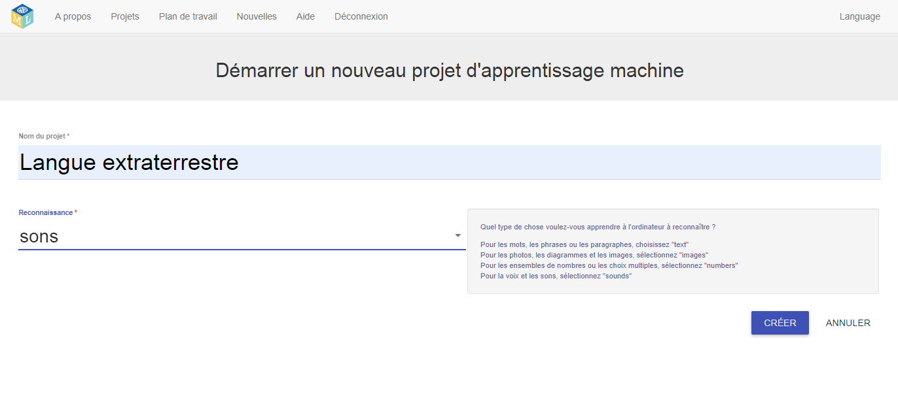

## Créer un nouveau projet
Dans les prochaines étapes, tu vas entraîner un modèle d’apprentissage machine pour voir comment cela s’est fait. Pour la suite du projet, tu utiliseras ta voix pour contrôler un personnage extraterrestre qui ne comprend pas l'anglais ! Tu vas inventer deux nouveaux mots qui ne se trouverais pas dans un dictionnaire anglais. Ensuite, tu utiliseras les mots pour contrôler le personnage extraterrestre et entraîneras un modèle d’apprentissage machine pour les reconnaître.

Tout d’abord, accède au site Machine Learning for Kids et crée un projet.

--- task ---
+ Va sur [machinelearningforkids.co.uk](https://machinelearningforkids.co.uk/){:target="_blank"}.

+ Clique sur **Démarrez**.

+ Clique sur **Essayer maintenant**. --- /task ---

--- task ---
+ Clique sur **Projets** dans la barre de menus en haut de la page.

+ Clique sur le bouton **Ajouter un nouveau projet**.

+ Nomme ton projet `Langue extraterrestre` et configure-le pour apprendre à reconnaître les `sons`. Ensuite, clique sur le bouton **Créer**. 

+ Tu devrais voir `Langue extraterrestre` dans la liste des projets. Clique sur le projet `Langue extraterrestre`. --- /task ---
