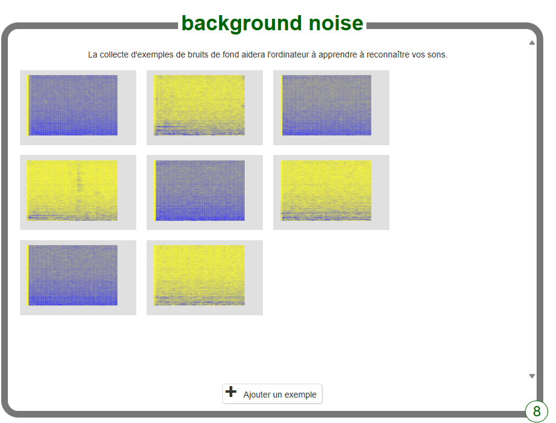

## Créer des mots extraterrestres
Dans cette étape, tu vas inventer tes mots extraterrestres.

--- task ---

Tu as besoin de deux mots : un mot extraterrestre pour « gauche » et un autre mot extraterrestre pour « droite ». Invente deux nouveaux mots qui ne se trouveraient pas dans un dictionnaire anglais. Il peut s'agir de bruits aléatoires, tant que tu peux les répéter de la même manière à chaque fois et qu'ils sont clairement différents les uns des autres. Si tu ne veux pas faire de bruit avec ta voix, ce n'est pas grave, tu peux trouver d'autres moyens de faire du bruit. Tu peux cliquer avec tes doigts, applaudir, serrer un jouet qui grince ou faire tout ce que tu peux imaginer ! Assure-toi simplement de te souvenir de tes nouveaux mots !

--- /task ---

--- task ---

+ Clique sur le bouton **Entraîner** pour commencer à collecter des exemples. 

+ Clique sur le bouton **Ajouter un exemple** dans l'élément **background noise**. L’enregistrement du bruit de fond aidera ton modèle d’apprentissage machine à faire la différence entre les sons que tu vas l’entraîner à reconnaître et le bruit de fond où tu te trouves. 

+ Clique sur le microphone pour enregistrer 2 secondes de bruit de fond. 

+ Clique sur le bouton **Ajouter** pour enregistrer ton enregistrement. 

+ Répète ces étapes jusqu'à obtenir au moins 8 exemples **de bruit de fond**. 

--- /task ---

--- task ---

+ Clique sur le bouton **Ajouter une nouvelle étiquette** dans le coin supérieur droit et crée un nouveau élément d'entraînement appelé `gauche`. 

+ Clique sur le bouton **Ajouter un exemple** dans le nouveau élément **gauche**. 

+ Enregistre **au moins 8 exemples.** de ton mot extraterrestre pour « gauche ». 

--- /task ---

--- task ---

+ Clique à nouveau sur le bouton **Ajouter une nouvelle étiquette** dans le coin supérieur droit et crée un nouvel élément d'entraînement appelé `droite`.

+ Clique sur le bouton **Ajouter un exemple** dans le nouvel élément **droite**.

+ Enregistre **au moins 8 exemples** de ton mot extraterrestre pour « droite ». 

+ **Remarque :** À la fin de cette étape, tu dois avoir huit exemples dans chacun des trois éléments.

--- /task ---
