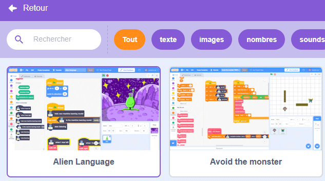
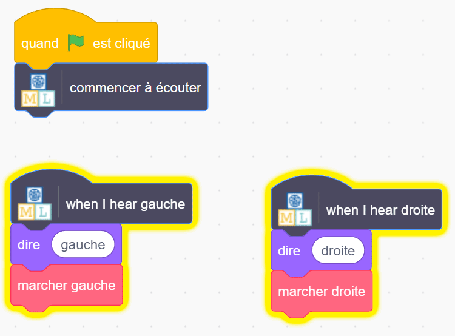

## Contrôler l'extraterrestre

<html>
  

    <iframe style="position: absolute; top: 0; left: 0; right: 0; width: 100%; height: 100%; border: none;" src="https://www.youtube.com/embed/cAovIpUuiGo?rel=0&cc_load_policy=1" allowfullscreen allow="accelerometer; autoplay; clipboard-write; encrypted-media; gyroscope; picture-in-picture; web-share"></iframe>
  

</html>

Maintenant que ton modèle peut distinguer les mots, tu peux l'utiliser dans un programme Scratch pour contrôler un extraterrestre.

--- task ---

+ Clique sur le lien **< Revenir au projet**.

+ Clique sur **Faire**.

+ Clique sur **Scratch 3**.

+ Clique sur **Ouvrir dans Scratch 3**.

--- /task ---

--- task ---

+ Clique sur **Modèles de projets** en haut et sélectionnez le projet « Alien language » pour charger le sprite extraterrestre, qui contient déjà du code ajouté.

--- /task ---

Machine Learning for Kids a ajouté des blocs spéciaux à Scratch pour te permettre d'utiliser le modèle que tu viens d'entraîner. Ce modèle de projet contient également des blocs spéciaux « marcher gauche » et « marcher droite » dans « Mes blocs ». Retrouve les deux en bas de la liste des blocs.

--- task ---

+ Assurez-toi d'avoir sélectionné le sprite **Extraterrestre**, puis clique sur l'onglet **Code** et ajoute ce code. (Garde le code qui est déjà là !) 

--- /task ---

--- task ---

+ Clique sur le **drapeau vert** et dis tes mots extraterrestres pour « gauche » et « droite ». Vérifie que l'extraterrestre se déplace dans la direction souhaitée.

--- /task ---

