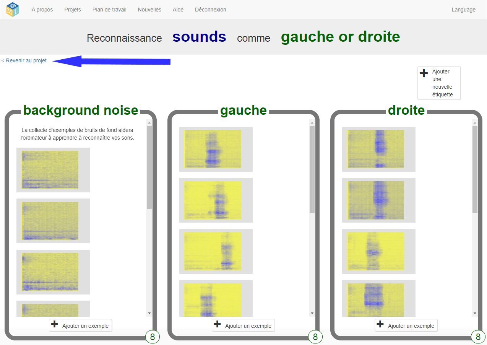
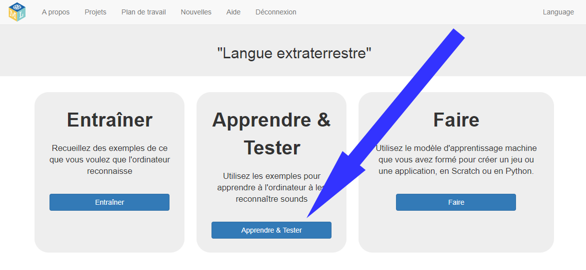
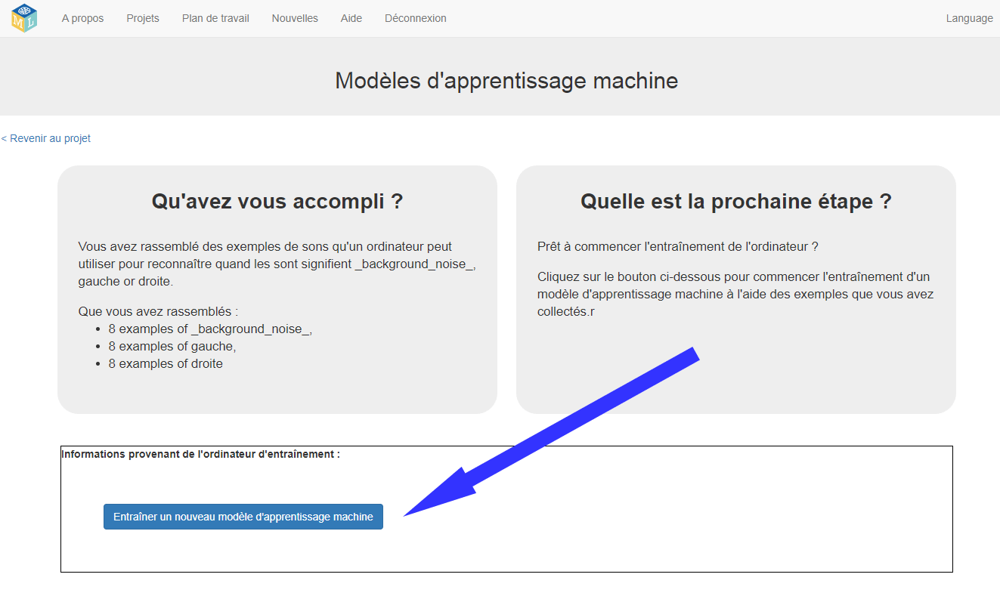
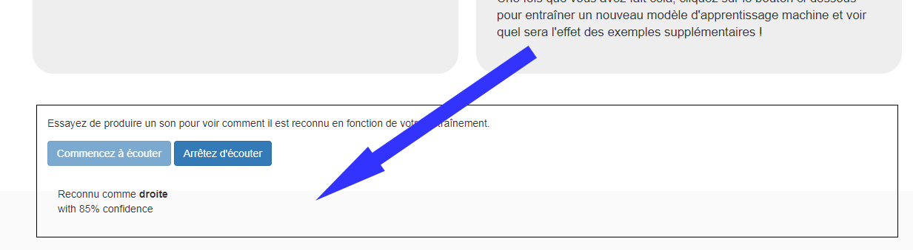

## Entraîner un nouveau modèle d'apprentissage machine
Dans cette étape, tu utiliseras les exemples que tu as rassemblés lors de la dernière étape pour apprendre à l'ordinateur à reconnaître tes nouveaux mots.

--- task ---

+ Clique sur le lien **Revenir au projet** dans le coin supérieur gauche. 

+ Clique sur le bouton **Apprendre & Tester**. 

+ Clique sur **Entraîner un nouveau modèle d'apprentissage machine**. Cela peut prendre quelques minutes. 

--- /task ---

--- task ---

+ Une fois l'entraînement terminé, clique sur le bouton **Commencer à écouter** pour tester ton modèle d'apprentissage machine. Prononce l’un des mots (ou fais l’un des sons) que tu as appris à l’ordinateur à reconnaître comme étant « gauche » ou « droite ». Si ton modèle d'apprentissage machine le reconnaît, il affichera ce qu'il pense que tu as dit. 

+ Si tu n'es pas satisfait du fonctionnement du modèle, reviens à la page **Entraîner** et ajoute d'autres exemples aux trois éléments d'entraînement.

+ Lorsque tu es satisfait de ton modèle d’apprentissage machine, passe à l’étape suivante.

--- /task ---
