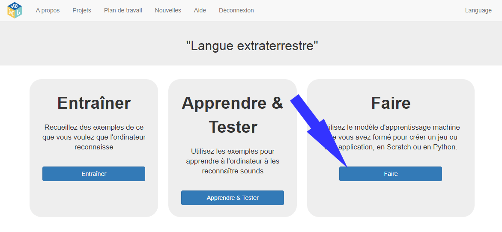
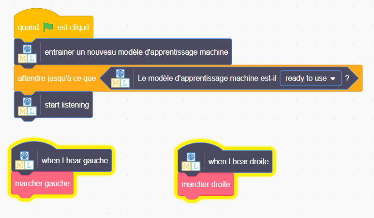

## Utiliser des mots extraterrestres dans Scratch
Dans cette étape, tu utiliseras ton nouvel apprentissage machine dans Scratch.

--- task ---

+ Clique sur le bouton **Créer**. 

+ Clique sur le bouton **Scratch 3** , puis clique sur **Ouvrir dans Scratch 3**.

+ Clique sur **Modèles de projet** en haut de l'écran, puis ouvre le modèle de projet **Langue extraterrestre**.

--- /task ---

--- task ---

+ Regarde les scripts pour le sprite extraterrestre. Les scripts déjà présents placeront le sprite extraterrestre au bon endroit au début et animeront son déroulement. Ne les supprime pas. Ajoute le script ci-dessous au sprite extraterrestre, sous les scripts déjà présents. 

+ Maintenant, teste ton programme ! Clique sur le drapeau vert. Prononce tes mots (ou fais tes bruits) pour « gauche » et « droite » pour dire à l'extraterrestre dans quelle direction il doit marcher.

--- /task ---

Tu as maintenant entraîné ton propre modèle d’apprentissage machine pour faire de la reconnaissance vocale et l’utiliser pour contrôler un personnage dans Scratch. Contrairement au modèle prédéfini que tu as utilisé précédemment dans le projet, qui avait été entraîné pour reconnaître des dizaines de milliers de mots, tu ne l'as entraîné que pour reconnaître deux mots différents. Cependant, le principe est le même.

Tu as également vu l’importance d'entraîner le modèle d’apprentissage machine avec un certain bruit de fond.

--- task ---

Peux-tu réfléchir à un exemple de système comme celui-ci que tu as déjà vu ? Par exemple, certaines voitures utilisent des systèmes de reconnaissance vocale entraînés pour reconnaître les différentes commandes que tu peux donner à l'ordinateur de bord. Quels autres exemples as-tu utilisés ?

--- /task ---
