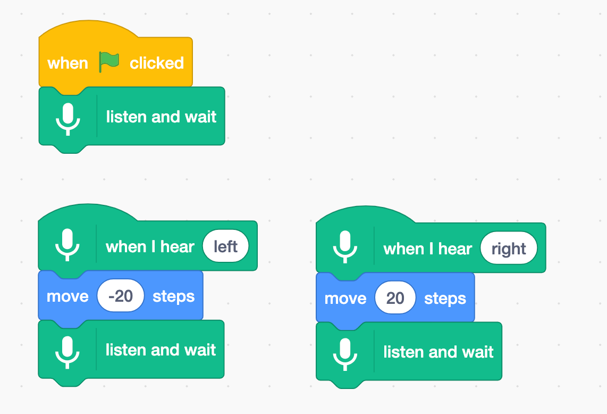

## एक पूर्व प्रशिक्षित मॉडल का उपयोग करें

--- task ---
+ [machinelearningforkids.co.uk/scratch3](https://machinelearningforkids.co.uk/scratch3/){:target="_blank"} पर जाएं --- /task ---

**चेतावनी:** परियोजना का यह चरण केवल Google Chrome वेब ब्राउज़र का उपयोग करके पूरा किया जा सकता है। यदि यह ब्राउज़र आपके लिए उपलब्ध नहीं है, तो कृपया [चरण 3: एक नई परियोजना बनाएं](https://projects.raspberrypi.org/hi-IN/projects/alien-language/3) पर जाएं

--- task ---
+ आगे **Speech to Text** एक्सटेंशन को लोड करें। **Extensions** बटन पर क्लिक करें जो नीचे बाएँ हाथ के कोने में है, और फिर सूची से **Speech to Text** चुनें। **टिप्पणी:** सुनिश्चित करें कि आप **Speech to Text** एक्सटेंशन का चयन कर रहे हैं, **Text to Speech** एक्सटेंशन का नहीं। 

+ **Events** खंड, **Motions** खंड, और नए **Speech to Text** खंड का उपयोग करें निम्नलिखित स्क्रिप्ट बनाने के लिए। 

--- /task ---

--- task --- अपने कोड का परीक्षण करने के लिए हरे झंडे पर क्लिक करें। "left" या "right" कहें। Scratch बिल्ली को उस दिशा में आगे बढ़ना चाहिए जो आप उसे बताते हैं। Scratch बिल्ली को स्क्रीन पर आगे और पीछे ले जाने की कोशिश करने के लिए अपनी आवाज़ का उपयोग करें। शांत और स्पष्ट रूप से बोलने की कोशिश करें।

इसे काम में लाना मुश्किल हो सकता है। यदि यह काम नहीं करता है, तो `say` खंड जोड़ें, ताकि आपकी स्क्रिप्ट नीचे दी गई स्क्रिप्ट की तरह दिखे, यह दिखाने के लिए कि उसके हिसाब से आप क्या कह रहे हैं।  --- /task ---

अब आपने Scratch में एक चरित्र को नियंत्रित करने के लिए भाषण मान्यता का उपयोग किया है।

इस चरण में, अपने प्रोग्राम को तेज़ी से काम करने के लिए, आपने एक मशीन लर्निंग मॉडल का उपयोग किया जो आपके लिए पहले से ही प्रशिक्षित था। यह एक सामान्य मशीन लर्निंग मॉडल है जिसे अंग्रेजी शब्दकोश में शब्दों को पहचानने के लिए प्रशिक्षित किया गया था। 
