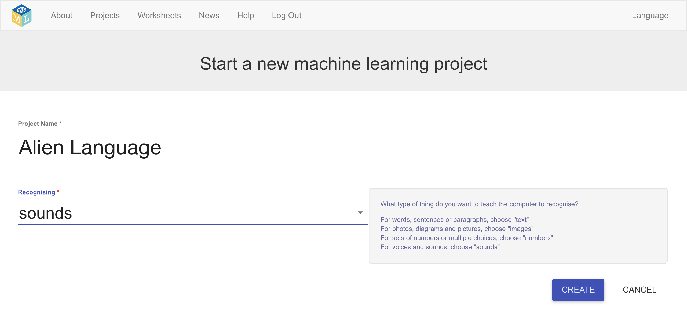

## एक नई परियोजना बनाएं
अगले कुछ चरणों में, आप मशीन लर्निंग मॉडल को यह देखने के लिए प्रशिक्षित करेंगे कि यह कैसे किया गया था। परियोजना के अगले भाग के लिए, आप अपनी आवाज़ का उपयोग एक एलियन चरित्र को नियंत्रित करने के लिए करेंगे जो अंग्रेजी नहीं समझता है! आप दो नए शब्दों का आविष्कार करेंगे जो एक अंग्रेजी शब्दकोश में नहीं मिलेंगे। फिर, आप एलियन चरित्र को नियंत्रित करने के लिए शब्दों का उपयोग करेंगे, और उन्हें पहचानने के लिए मशीन लर्निंग मॉडल को प्रशिक्षित करेंगे।

सबसे पहले, Machine Learning for Kids वेबसाइट पर जाएं और एक परियोजना बनाएं।

--- task ---
+ [machinelearningforkids.co.uk](https://machinelearningforkids.co.uk/){:target="_blank"} पर जाएं।

+ **Get started** पर क्लिक करें।

+ **Try it now** पर क्लिक करें। --- /task ---

--- task ---
+ पृष्ठ के शीर्ष पर मेन्यू बार में **Projects** पर क्लिक करें।

+ **Add a new project** बटन पर क्लिक करें।

+ अपनी परियोजना का नाम `Alien Language` रखें और यह निर्धारित करे कि `sounds` को पहचाना कैसे सीखा जाए। फिर, **Create** बटन पर क्लिक करें। 

+ आपको परियोजनाओं की सूची में `Alien Language` दिखना चाहिए। `Alien Language` परियोजना पर क्लिक करें। --- /task ---
