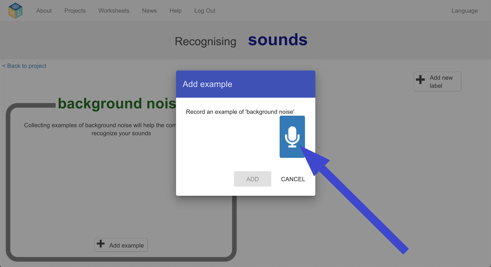
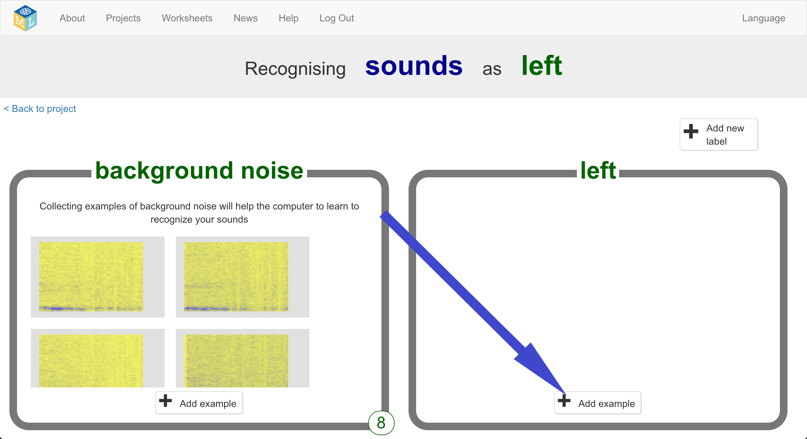
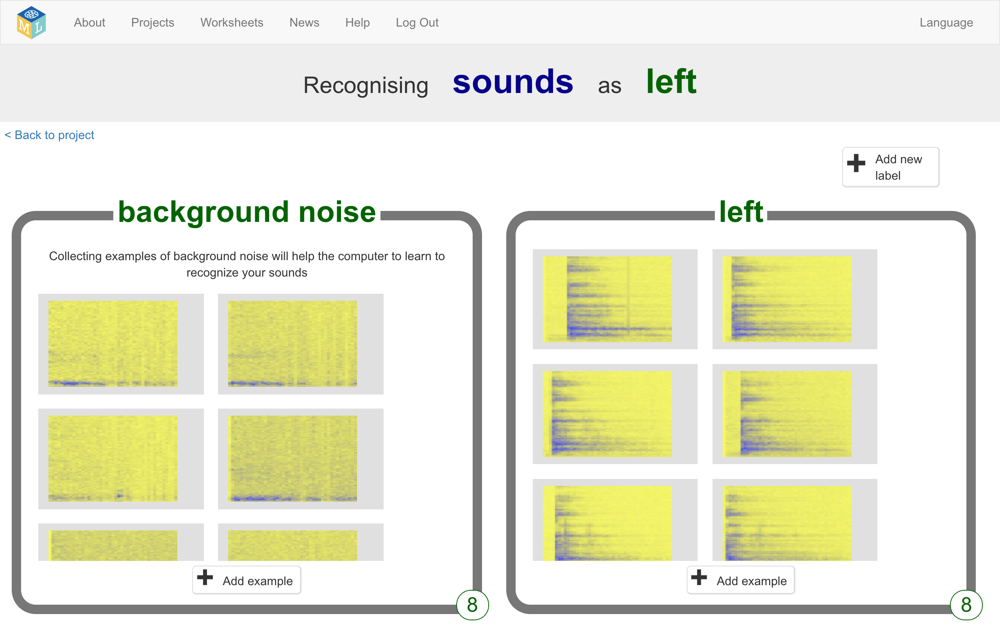
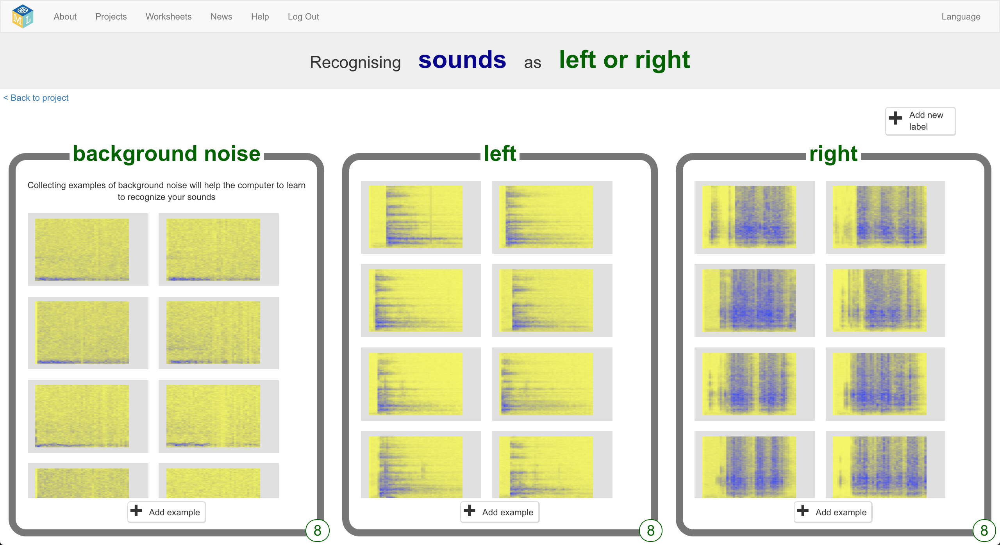

## एलियन शब्द बनाएं
इस चरण में, आप अपने एलियन शब्दों का आविष्कार करेंगे।

--- task ---

आपको दो शब्दों की आवश्यकता है - "left" के लिए एक एलियन शब्द और "right" के लिए एक एलियन शब्द। दो नए शब्दों का आविष्कार कीजिये जो एक अंग्रेजी शब्दकोश में नहीं मिलेंगे। वे यादृच्छिक शोर हो सकते हैं, जब तक आप उन्हें हर बार उसी तरह से दोहरा सकते हैं और वे एक दूसरे से अलग-अलग होते हैं। यदि आप अपनी आवाज के साथ शोर नहीं करना चाहते हैं, तो आप शोर करने के अन्य तरीके खोज सकते हैं। आप अपनी उंगलियों को क्लिक कर सकते हैं, अपने हाथों से ताली बजा सकते हैं, एक चीख़ता खिलौना निचोड़ सकते हैं, या ऐसा कुछ भी कर सकते हैं जिसके बारे में आप सोच सकते हैं! बस यह सुनिश्चित करें कि आप अपने नए शब्दों को याद रख सकेंगे!

--- /task ---

--- task ---

+ **Train** बटन पर क्लिक करें नमूने इकट्ठा करना शुरू करने के लिए। 

+ **background noise** बाल्टी में **Add example** बटन पर क्लिक करें। पृष्ठभूमि शोर की रिकॉर्डिंग आपके मशीन लर्निंग मॉडल को आवाज़ों के बीच अंतर बताने में मदद करेगी, जो आप इसे पहचानने के लिए प्रशिक्षित करेंगे, और पृष्ठभूमि शोर उस जगह का जहाँ आप हैं। 

+ पृष्ठभूमि शोर के 2 सेकंड रिकॉर्ड करने के लिए माइक्रोफ़ोन पर क्लिक करें। 

+ **Add** बटन पर क्लिक करें अपनी रिकॉर्डिंग save करने के लिए। 

+ उन चरणों को तब तक दोहराएं जब तक आपके पास **कम से कम 8 उदाहरण** न हों पृष्ठभूमि शोर की। 

--- /task ---

--- task ---

+ **Add new label** बटन पर क्लिक करें जो ऊपरी दायां किनारे में है, और `left` नामक एक नयी प्रशिक्षण बाल्टी बनाएँ। 

+ **left** बाल्टी में **Add example** बटन पर क्लिक करें। 

+ रिकॉर्ड करें **कम से कम 8 उदाहरण** "left" के लिए अपने एलियन शब्द के। 

--- /task ---

--- task ---

+ **Add new label** बटन पर क्लिक करें जो ऊपरी दायां किनारे में है, और `right` नामक एक नयी प्रशिक्षण बाल्टी बनाएँ।

+ **right** बाल्टी में **Add example** बटन पर क्लिक करें।

+ रिकॉर्ड करें **कम से कम 8 उदाहरण** "right" के लिए अपने एलियन शब्द के। 

+ **टिप्पणी:** इस चरण के अंत तक, आपके पास प्रत्येक तीन बाल्टियों में आठ उदाहरण होने चाहिए।

--- /task ---
