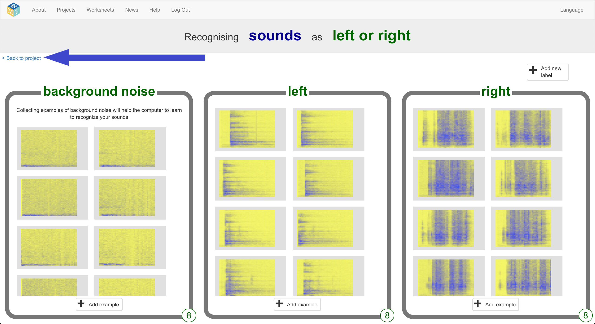
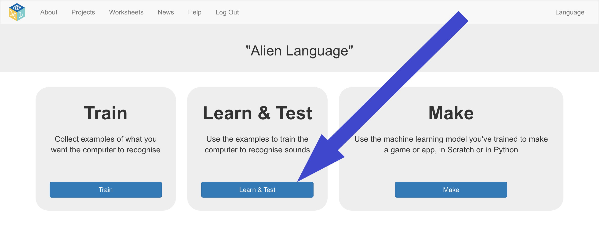
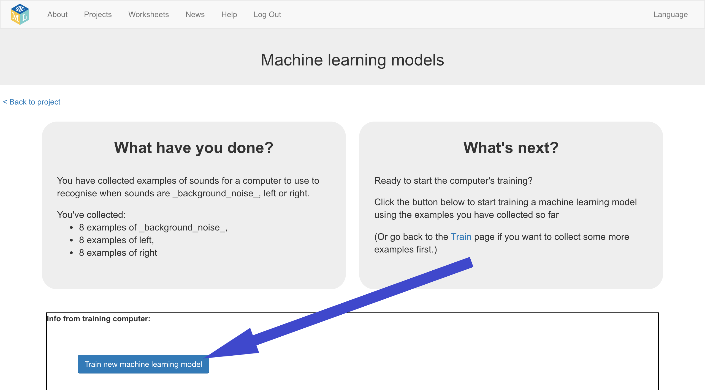
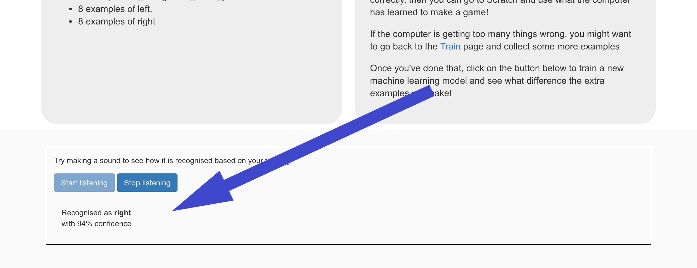

## एक नई मशीन लर्निंग मॉडल को प्रशिक्षित करें
इस चरण में, आप उन उदाहरणों का उपयोग करेंगे जो आपने पिछले चरण में कंप्यूटर को प्रशिक्षित करने के लिए एकत्र किए थे कि कैसे अपने नए शब्दों को पहचानें।

--- task ---

+ **Back to project** लिंक पर क्लिक करें जो ऊपरी बाएँ हाथ के कोने में है। 

+ **Learn & Test** बटन पर क्लिक करें। 

+ **Train new machine learning model** पर क्लिक करें। इसे पूरा होने में कुछ मिनट लग सकते हैं। 

--- /task ---

--- task ---

+ प्रशिक्षण समाप्त होने के बाद, **Start listening** बटन पर क्लिक करें अपने मशीन लर्निंग मॉडल का परीक्षण करने के लिए। शब्दों में से एक कहें (या आवाज़ों में से एक बनाएं) जिसे आपने कंप्यूटर को "left" या "right" के रूप में पहचानने के लिए प्रशिक्षित किया है। यदि आपका मशीन लर्निंग मॉडल इसे पहचानता है, तो यह प्रदर्शित करेगा जो उसे लगता है कि आपने कहा था। 

+ यदि आप मॉडल के काम करने के तरीके से खुश नहीं हैं, तो **Train** पृष्ठ पर वापस जाएँ और तीनों प्रशिक्षण बाल्टी में और उदाहरण जोड़ें।

+ जब आप अपने मशीन लर्निंग मॉडल से खुश हों, तो अगले चरण पर जाएं।

--- /task ---
