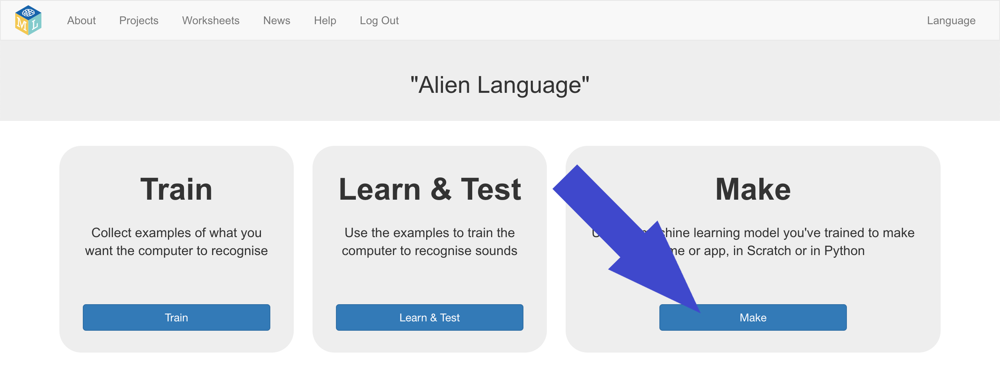
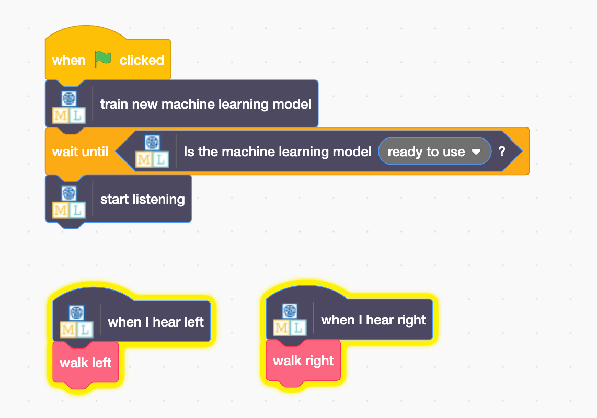

## Scratch में एलियन शब्दों का प्रयोग करें
इस चरण में, आप अपनी नई मशीन लर्निंग का उपयोग Scratch में करेंगे।

--- task ---

+ **Make** बटन पर क्लिक करें। 

+ **Scratch 3** बटन पर क्लिक करें, फिर **Open in Scratch 3** पर क्लिक करें।

+ स्क्रीन के शीर्ष पर **Project templates** पर क्लिक करें, फिर **Alien Language** परियोजना का खाका खोलें।

--- /task ---

--- task ---

+ एलियन sprite के लिए स्क्रिप्ट देखें। जो स्क्रिप्ट पहले से ही हैं, वो शुरुआत में एलियन sprite को सही जगह पर डालेंगे और यह चेतन करेंगे कि यह कैसे चलता है। उन्हें ना मिटायें। नीचे दी गयी स्क्रिप्ट एलियन sprite से जोड़ें, पहले से मौजूद स्क्रिप्ट्स के नीचे। 

+ अब, अपने प्रोग्राम का परीक्षण करें! हरे झंडे पर क्लिक करें । एलियन को यह बताने के लिए कि "left" जाना है या "right", अपने शब्द कहें (या अपने शोर मचाये)।

--- /task ---

आपने अब भाषण पहचान करने के लिए अपने स्वयं के मशीन लर्निंग मॉडल को प्रशिक्षित किया है, और इसका उपयोग Scratch में एक चरित्र को नियंत्रित करने के लिए किया है। परियोजना में आपने पहले इस्तेमाल किए गए पूर्व प्रशिक्षित मॉडल के विपरीत, जिसे दसियों हज़ार शब्दों को पहचानने के लिए प्रशिक्षित किया गया था, आपने इसे केवल दो अलग-अलग शब्दों को पहचानने के लिए प्रशिक्षित किया है। हालांकि, सिद्धांत समान है।

आपने एक निश्चित पृष्ठभूमि शोर के साथ काम करने के लिए मशीन लर्निंग मॉडल के प्रशिक्षण के महत्व को भी देखा है।

--- task ---

क्या आप इस तरह के एक सिस्टम के बारे में सोच सकते हैं जो आपने पहले देखा हो? उदाहरण के लिए, कुछ कारें भाषण मान्यता प्रणाली का उपयोग करती हैं जिन्हें विभिन्न आज्ञाओं को पहचानने के लिए प्रशिक्षित किया गया, है जो आप इन-कार कंप्यूटर को दे सकते हैं। आपने किन अन्य उदाहरणों का उपयोग किया है?

--- /task ---
