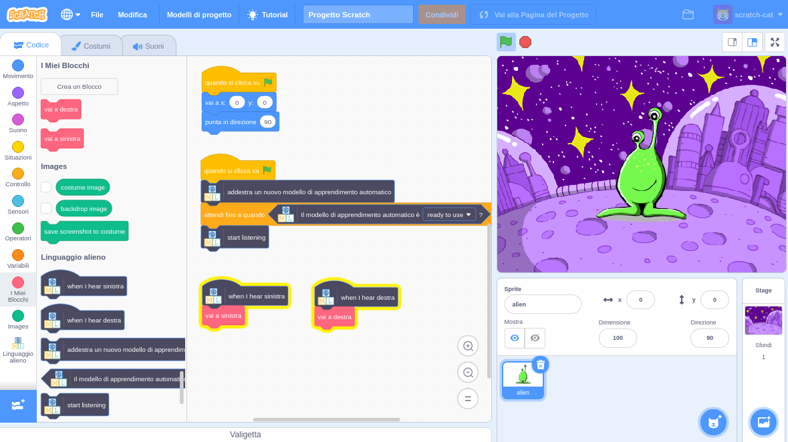

## Introduzione

In questo progetto, addestrerai il computer a comprendere una lingua aliena. Lo userai per controllare un personaggio alieno in modo che possa capire cosa gli dici di fare.

### Che cosa creerai

--- no-print ---

--- /no-print ---

--- print-only ---

--- /print-only ---

--- collapse ---
---
title: Di cosa avrai bisogno
---

+ Un computer con un microfono

+ accesso ad Internet

--- /collapse ---

--- collapse ---
---
title: Cosa imparerai
---
+ Come usare l'estensione Riconoscimento della voce in Scratch 3 con un modello predisposto
+ Come addestrare un modello di apprendimento automatico a riconoscere i suoni
+ Come utilizzare il modello di apprendimento automatico addestrato in Scratch 3

--- /collapse ---

--- collapse ---
---
title: Informazioni aggiuntive per gli educatori
---

Se intendete stampare questo progetto, cliccate su [Versione stampabile](https://projects.raspberrypi.org/en/projects/alien-language/print){:target="_blank"}.

--- /collapse ---

### Licenza

Questo progetto ha una doppia licenza, sia [Licenza Creative Commons Attribution Non-Commercial Share-Alike](http://creativecommons.org/licenses/by-nc-sa/4.0/){:target="_blank"} che [Licenza Apache Versione 2.0](http://www.apache.org/licenses/LICENSE-2.0){:target="_blank"}

Vorremmo ringraziare Dale di machinelearningforkids.co.uk per tutto il suo lavoro su questo progetto.
