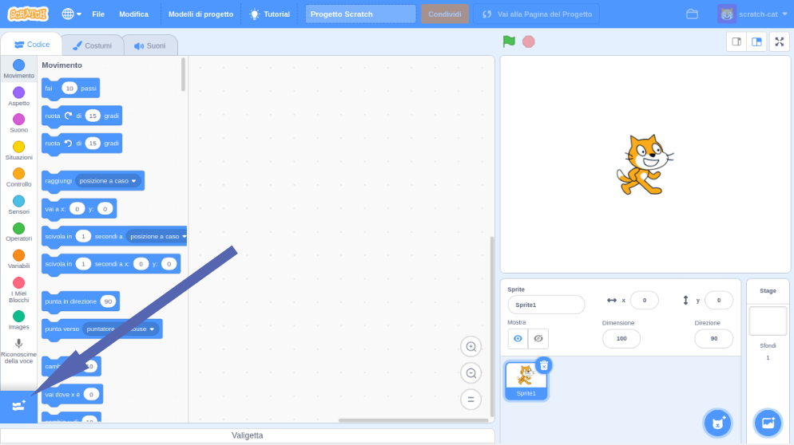

## Usa un modello pre-allenato

--- task ---
+ Vai qui [machinelearningforkids.co.uk/scratch3](https://machinelearningforkids.co.uk/scratch3/){:target="_blank"}
--- / task ---

**Attenzione:** Questo passaggio del progetto può essere completato solo utilizzando il browser Web Google Chrome. Se non hai questo browser, vai al [passaggio 3: crea un nuovo progetto](https://projects.raspberrypi.org/en/projects/alien-language/3)

--- task ---
+ Successivamente, carica l'estensione **Riconoscimento della voce**. Fai clic sul pulsante **Estensioni** nell'angolo in basso a sinistra, quindi scegli **Riconoscimento della voce** dall'elenco. **Nota:** Assicurarsi di selezionare l'estensione **Riconoscimento della voce**, non l'estensione **Da testo a voce**. 

+ Usa i blocchi **Situazioni**, **Movimento** e i nuovi **Riconoscimento della voce** per creare i seguenti codici. 

--- /task ---

--- task --- Clicca sulla bandiera verde per eseguire il tuo script. Pronuncia "sinistra" o "destra". Il gatto Scratch dovrebbe muoversi nella direzione in cui gli hai detto. Usa la tua voce per provare a spostare il gatto Scratch avanti e indietro sullo schermo. Cerca di parlare con calma e in modo chiaro.

Può essere difficile farlo funzionare. Se non funziona, aggiungi il blocco `dire` in modo che il tuo codice assomigli al seguente, per mostrare cosa pensa che tu stia dicendo.  --- /task ---

Ora hai usato il riconoscimento vocale per controllare un personaggio in Scratch.

In questo passaggio, per far funzionare rapidamente il tuo programma, hai utilizzato un modello di apprendimento automatico che era già stato addestrato per te. È un modello generale di apprendimento automatico che è stato addestrato per riconoscere le parole nel dizionario italiano. 
