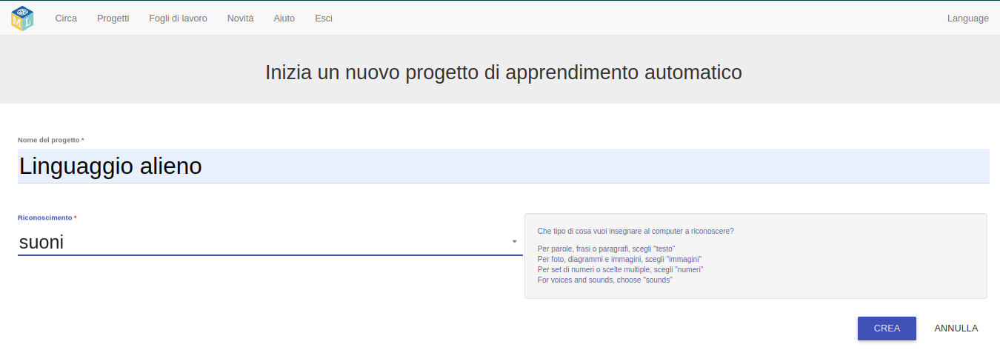

## Crea un nuovo progetto
Nei prossimi passaggi, dovrai addestrare un modello di apprendimento automatico per capire come è stato realizzato. Per la parte successiva del progetto, userai la tua voce per controllare un personaggio alieno che non capisce l'italiano! Inventerai due nuove parole che non si possono trovare in un dizionario italiano. Quindi, userai le parole per controllare il personaggio alieno e addestrerai un modello di apprendimento automatico a riconoscerle.

Innanzitutto, vai al sito web Machine Learning for Kids e crea un progetto.

--- task ---
+ Vai qui [machinelearningforkids.co.uk](https://machinelearningforkids.co.uk/){:target="_blank"}.

+ Fai clic su **Iniziamo**.

+ Fai clic su **Prova subito**. --- /task ---

--- task ---
+ Fai clic su **Progetti** nella barra dei menu nella parte superiore della pagina.

+ Fai clic sul pulsante **Aggiungi un nuovo progetto**.

+ Assegna un nome al tuo progetto `Linguaggio alieno` e impostalo per imparare a riconoscere `suoni`. Quindi, fai clic sul pulsante **Crea**. 

+ Dovresti vedere `Linguaggio alieno` nell'elenco dei progetti. Fai clic sul progetto `Linguaggio alieno`. --- /task ---
